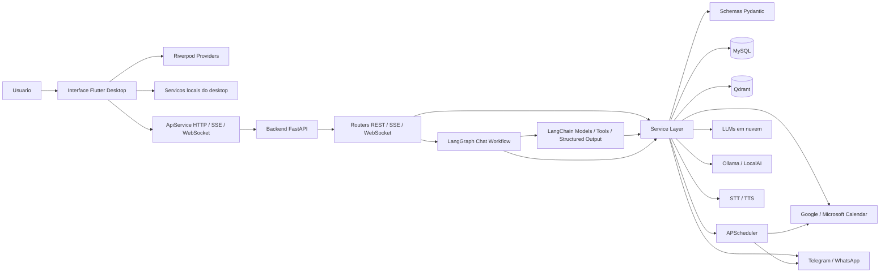
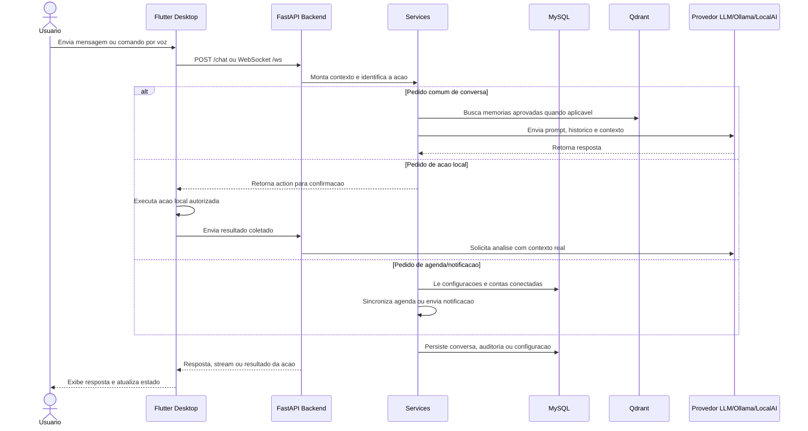
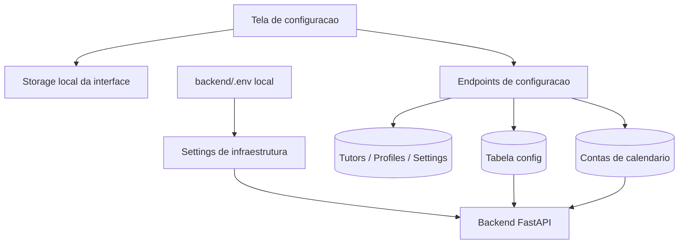
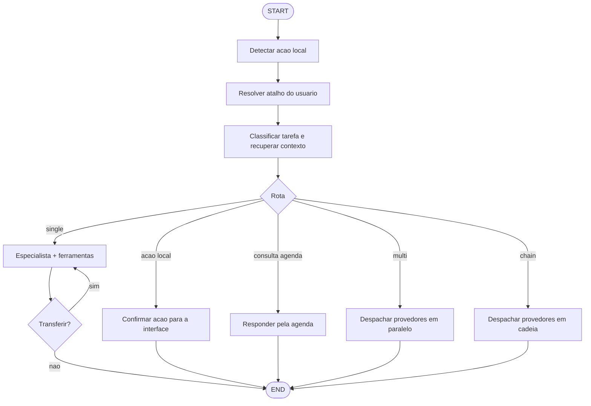
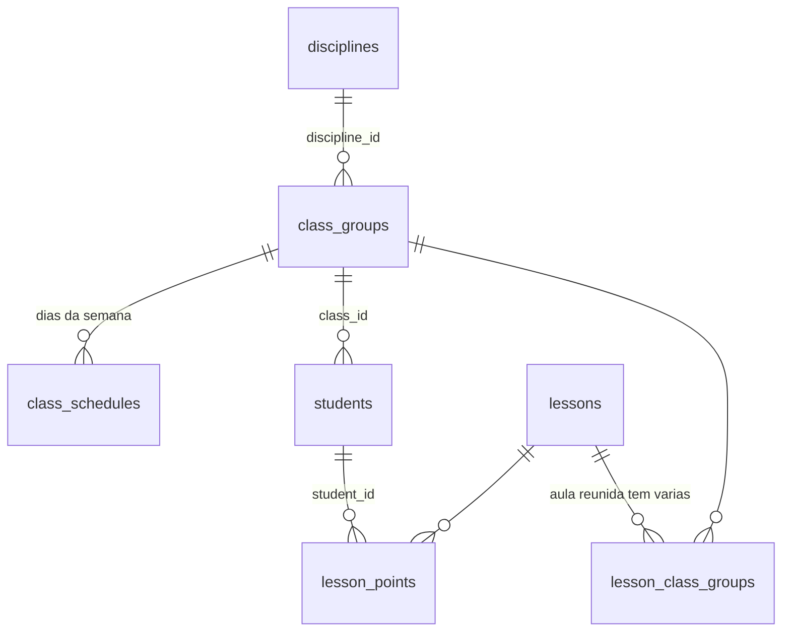
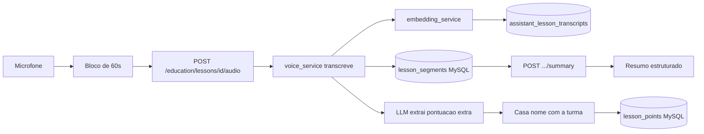

# Assistente Desktop

Aplicacao de assistente pessoal desktop com backend FastAPI, interface Flutter,
memoria vetorial, automacoes locais, integracao com calendarios, voz,
notificacoes e multiplos provedores de LLM.

O projeto foi pensado para rodar localmente, com dados e credenciais sensiveis
fora do repositorio. O arquivo `backend/.env.example` documenta apenas as
variaveis de infraestrutura e provedores que continuam vindo do ambiente. As
configuracoes de notificacao e calendario sao persistidas no banco pela propria
aplicacao.

## Arquitetura

O projeto e dividido em duas aplicacoes principais: uma interface desktop em
Flutter e um backend local em FastAPI. O backend concentra regras de negocio,
persistencia, integracoes externas e comunicacao com provedores de LLM. A
interface fica responsavel pela experiencia desktop, estado visual, captura de
contexto local e comunicacao com a API.

```text
assistant_app/
|-- backend/                 FastAPI + Python
|   |-- app/
|   |   |-- core/            configuracao, banco e seguranca
|   |   |-- models/          schemas Pydantic e contratos de API
|   |   |-- routers/         endpoints REST, SSE e WebSocket
|   |   |-- services/        regras de negocio e integracoes externas
|   |   `-- utils/           scheduler e utilitarios
|   |-- tests/               testes unitarios do backend
|   |-- Dockerfile
|   `-- requirements.txt
|
|-- interface/               Flutter Desktop + Dart
|   |-- lib/
|   |   |-- models/          modelos de estado e DTOs
|   |   |-- providers/       estado global via Riverpod
|   |   |-- screens/         telas principais
|   |   |-- services/        clientes HTTP/WebSocket e servicos locais
|   |   |-- utils/           tema e helpers
|   |   `-- widgets/         componentes reutilizaveis
|   `-- test/                testes da interface
|
|-- ollama/                  imagem auxiliar para modelo local
|-- docker-compose.yml       MySQL, Qdrant, Redis, Ollama e backend
|-- setup.bat
`-- setup.sh
```

### Diagrama De Componentes



### Componentes

- **Interface desktop**: Flutter Desktop, com runner Windows versionado neste
  repositorio. Cuida de chat, configuracao inicial, captura de contexto local,
  atalhos, voz e preferencias.
- **Backend API**: FastAPI com REST, SSE e WebSocket para chat, historico,
  agenda, notificacoes, automacoes, memoria e acoes locais.
- **Orquestracao de chat**: LangGraph torna explicitas a deteccao de acoes, a
  resolucao de atalhos, as consultas de agenda e as rotas single, multi e chain
  sem alterar o contrato consumido pela interface.
- **Adaptacao LangChain**: padroniza os provedores existentes, expoe as
  propostas de acoes como tools tipadas e valida as respostas internas com
  modelos Pydantic. A selecao das tools e deterministica; nao ha execucao
  autonoma de comandos pelo backend.
- **Banco relacional**: MySQL via SQLAlchemy async para conversas,
  configuracoes, perfis, atalhos, auditoria e automacoes aprovadas.
- **Memoria vetorial**: Qdrant para memorias revisadas e aprovadas.
- **LLMs**: provedores em nuvem configurados por `.env` e modelos locais via
  Ollama ou LocalAI.
- **Scheduler**: APScheduler para sincronizacao periodica de calendario e envio
  de lembretes.
- **Agenda conversacional**: interpreta com IA consultas como compromissos de
  hoje ou da proxima semana, valida o periodo no backend e responde somente com
  eventos retornados pelo Google Calendar ou Microsoft Graph.
- **Rate limiting**: Redis + fastapi-limiter, com limite geral e um mais
  rigido por IP nas rotas de autenticacao. Se o Redis cair, o backend segue no
  ar sem aplicar limite.

## Diagrama De Fluxo Da Aplicacao

Fluxo principal de uma interacao de chat:



Fluxo de configuracao e persistencia:



## Padrao De Projeto

O projeto usa principalmente **arquitetura em camadas** com **Service Layer**.
O objetivo e manter transporte, regra de negocio, persistencia e UI separados.

### Backend

No backend, o padrao principal e:

- `routers`: camada de transporte. Recebe requests, valida entrada e devolve
  responses. Nao deve concentrar regra de negocio pesada.
- `services`: regras de negocio, integracoes externas e orquestracao.
- `models`: contratos Pydantic usados pela API e pela aplicacao.
- `core`: infraestrutura compartilhada, como configuracao, banco e seguranca.
- `utils`: processos auxiliares, como scheduler.

Na pratica, isso cria este fluxo:

```text
Request -> Router -> Service -> Database/Provider -> Service -> Response
```

Padroes usados no backend:

- **Service Layer**: `app/services` concentra integracoes com LLMs, calendario,
  notificacoes, voz, Qdrant e runtime config.
- **DTO / Schema Objects**: `app/models/schemas.py` define contratos de entrada
  e saida com Pydantic.
- **Dependency Injection simples**: FastAPI injeta sessoes de banco e
  autenticacao via `Depends`.
- **Repository leve via SQLAlchemy**: os modelos em `core/database.py` sao
  acessados pelos routers/services com sessoes async.
- **Configuration Object**: `core/config.py` centraliza settings vindos do
  ambiente.

### Interface

A interface segue separacao semelhante:

- `screens`: composicao de telas e fluxos principais.
- `widgets`: componentes visuais reutilizaveis.
- `services`: acesso ao backend, armazenamento local e integracoes do desktop.
- `providers`: estado global da aplicacao.
- `models`: configuracoes e estruturas de dados usadas pela UI.

Padroes usados na interface:

- **Provider/State Management**: Riverpod centraliza estado compartilhado.
- **Service Client**: `ApiService` encapsula HTTP, SSE e WebSocket.
- **Local Services**: servicos especificos isolam automacao local, workspace,
  scripts e contexto de janelas.
- **Component Composition**: telas sao compostas por widgets menores e
  reutilizaveis.

Esse desenho evita colocar regra de negocio nos endpoints ou nos widgets,
mantendo integracoes e fluxos testaveis em servicos dedicados.

### Workflow De Chat Com LangChain E LangGraph

As requisicoes completas de chat, tanto REST quanto WebSocket, passam pelo
grafo compilado em `backend/app/services/chat_graph_service.py`:



O no `retrieve_context` faz duas coisas antes de qualquer provedor ser
escolhido: classifica o pedido (`code`, `study`, `calendar`, `general`) e, so
quando e estudo, busca trechos das aulas gravadas no Qdrant e os anexa ao
prompt. A busca vetorial nao roda no caminho comum de conversa.

O modo `single` passa por especialistas. O roteador escolhe quem atende a
partir da tarefa, o especialista recebe apenas as ferramentas da area dele e
pode transferir a conversa (A2A) quando o pedido nao for seu. A transferencia e
validada pelo orquestrador — destino desconhecido ou ja visitado encerra o
repasse, e `AGENT_MAX_HANDOFFS` limita a cadeia. Os modos `multi` e `chain`
continuam despachando direto, sem especialistas.

| Especialista | Atende | Ferramentas |
| --- | --- | --- |
| `general` | conversa ampla | MCP |
| `code` | codigo, workspace, scripts | acoes de codigo/PC/projeto + MCP |
| `study` | aulas gravadas e conteudo | nenhuma (usa o contexto recuperado) |
| `calendar` | compromissos e eventos | proposta de evento |

O grafo orquestra os servicos existentes; ele nao acessa diretamente o
computador nem substitui as confirmacoes da interface. O endpoint SSE e a
mensagem WebSocket `chat_stream` continuam com despacho direto para preservar
o streaming incremental de tokens.

O LangGraph usa duas integrações LangChain:

- `backend/app/services/assistant_tools.py` registra tools que apenas propoem
  diagnosticos, scripts, inspecao de workspace, abertura de projeto e cadastro
  de atalhos. A execucao continua dependendo da confirmacao da interface.
- `backend/app/services/langchain_agent_service.py` adapta todos os provedores
  atuais para `BaseChatModel`, converte o historico em mensagens LangChain e
  transforma cada retorno em uma resposta Pydantic estruturada antes de
  devolve-lo ao grafo. Tambem implementa `bind_tools` e o ciclo
  modelo -> ferramenta -> modelo.
- `backend/app/services/agent_service.py` define os especialistas, monta o
  conjunto de ferramentas de cada um e conduz as transferencias A2A.
- `backend/app/services/mcp_service.py` conecta servidores MCP externos e
  converte as ferramentas deles em tools LangChain.

#### Tool-calling nos dez provedores

O `ProviderChatModel` fala com dez provedores por um gateway HTTP proprio, e
varios deles (Ollama, LocalAI, Hugging Face) nao expoem tool-calling nativo.
Em vez de reescrever as dez integracoes, o `bind_tools` injeta o catalogo de
ferramentas no prompt e le a escolha de volta como JSON, convertendo em
`tool_calls` do LangChain. Isso e **tool-calling por protocolo textual**, nao
pela API nativa de cada provedor — a vantagem e funcionar igual em todos,
inclusive nos modelos locais; o custo e depender do modelo respeitar o formato.
O nome escolhido e validado contra o catalogo, entao alucinacao nao vira
execucao de ferramenta.

#### MCP

Servidores MCP sao processos externos e podem estar fora do ar. Falha de
conexao nunca derruba o chat: o assistente responde sem aquelas ferramentas, e
a falha fica em cache por alguns minutos para nao tentar reconectar a cada
mensagem. `GET /system/agents/status` mostra especialistas, servidores MCP
conectados, ferramentas disponiveis e o provedor de embeddings ativo.

### Modo Educacao

Grava a aula em blocos, transcreve cada bloco, indexa a transcricao no Qdrant e
gera o resumo sob demanda. Acessivel pelo botao "Modo Aula" no painel esquerdo
da interface.

As abas seguem a ordem de uso — `1. TURMAS`, `2. GRAVAR AULA`, `3. PONTUACOES`,
`4. HISTORICO` — porque o cadastro precede a gravacao: e ele que ancora os nomes
ouvidos no audio. Sem turma cadastrada o dialogo abre no cadastro; com turma,
abre direto na gravacao. A pontuacao nao tem botao: o professor cita o aluno em
voz alta durante a aula ("meio ponto extra para a Ana pela participacao") e o
trecho seguinte traz o registro. O `4. HISTORICO` lista as aulas do periodo,
mostra resumo, transcricao e pontuacao de cada uma e permite corrigir tema e
turmas depois — inclusive de aula ja encerrada. De la tambem se pede o resumo
de uma aula antiga e se exporta o resultado em PDF.

#### Disciplina, turma e horario

Disciplina e turma nao sao mais texto repetido no aluno e na aula. `disciplines` e
a disciplina ministrada (`code` ARA0040, `name` BANCO DE DADOS). O modulo
chamava isso de `subject`, palavra que tambem significa assunto e que ja era
usada para o titulo do evento de calendario e para o assunto do email; o termo
foi renomeado em toda a educacao, com migracao automatica na subida.
`class_groups` e a turma (`code` 3001, `name` Presencial), pendurada na
disciplina por `discipline_id`. O aluno aponta para a turma por `students.class_id`
e a aula por `lesson_class_groups`, um vinculo N:N — e assim que uma aula
reunida atende duas turmas ao mesmo tempo e que duas turmas da mesma disciplina
no mesmo dia continuam distintas.

`class_schedules` guarda os dias da turma (`weekday` 0 = segunda, com horario
opcional). Uma disciplina que cai na segunda e na quinta tem uma linha por dia,
e cada dia pode ter mais de uma turma. Na aba de gravacao, as turmas que tem
aula hoje aparecem primeiro, sob o titulo do dia, e ja vem marcadas — e dai que
sai a aula reunida sem ninguem precisar lembrar quais turmas sao.



Os campos de texto `class_group` e `subject` continuam gravados no aluno e na
aula como copia do rotulo da turma, para consulta por nome seguir funcionando;
quem manda e o vinculo. Renomear a turma desce o novo rotulo para os alunos
dela. Na primeira subida do backend, `_backfill_class_groups` deriva as turmas
dos textos que ja existiam, liga cada aluno a sua e liga cada aula — aula que
estava sem turma no texto era o jeito antigo de dizer reunida, entao entra ligada
a todas as turmas da disciplina.



Pontos de atencao do fluxo:

- **Transcricao e indexacao sao independentes.** Se o Qdrant estiver fora, o
  trecho continua gravado no MySQL e a aula nao para; so a busca semantica
  daquele trecho fica pendente. O MySQL e a fonte da verdade e o Qdrant um
  indice derivado dele, entao trecho sem vetor nunca e trecho perdido: cada
  segmento guarda o modelo que gerou o seu vetor e a reindexacao refaz o que
  faltar a partir do banco.
- **O cadastro da turma ancora os nomes.** O transcritor erra nomes proprios com
  frequencia, entao o LLM recebe a lista de alunos e o backend ainda faz
  casamento por apelido, primeiro nome unico e similaridade. Sem correspondencia,
  a pontuacao e gravada com o nome ouvido e marcada para revisao na interface.
- **Duas turmas da mesma disciplina se separam pelo vinculo.** Na aba de
  gravacao, as turmas aparecem como marcadores: marcar uma so restringe o
  reconhecimento de nomes aos alunos dela, marcar duas faz a aula reunida. Aluno
  sem turma nenhuma no cadastro segue valendo para qualquer aula, e aula antiga,
  anterior a tabela de turmas e sem vinculo, ainda cai na comparacao por texto.
- **A turma do ponto vem do aluno.** `lesson_points` nao guarda esse campo, entao
  o relatorio resolve com dois `LEFT OUTER JOIN`: o cadastro do aluno primeiro e
  a aula como reserva, para quando o nome nao casou com ninguem. E por isso que
  aula reunida ainda fecha nota separada por turma. Os joins sao externos de
  proposito: ponto de aula apagada continua no relatorio, com a turma vazia.
- **Pontuacao so e gravada com prova na transcricao.** Sao tres portas antes de
  chamar o LLM e depois dele: o trecho precisa conter uma palavra de gatilho
  (`ponto`, `decimo`, `bonus`, `extra`...), a citacao devolvida precisa existir
  na transcricao e o nome premiado precisa ter sido dito ali. Sem isso o modelo
  premia aluno que so aparece na lista da turma enviada no prompt. O que e
  descartado fica no log.
- **O PDF do resumo sai da propria interface.** O documento e montado com o
  `pdf` puro Dart a partir do markdown do resumo, com a paleta do aplicativo:
  faixa escura no cabecalho, etiquetas em caixa alta com espacamento e o verde
  de destaque nas divisorias. O corpo e claro porque resumo de aula acaba
  impresso. Roboto vai embutido em `interface/assets/fonts` — sem uma TTF de
  verdade o `pdf` cai na Helvetica interna, que nao tem acento e devolveria
  "normalizacao" no lugar de "normalização".
- **A sessao e renovada durante a aula.** O token vale 24h; uma aula de duas
  horas com token velho estourava no meio e os blocos passavam a voltar 401.
  Agora o app chama `POST /auth/refresh` ao abrir, ao iniciar a aula e a cada 20
  minutos de gravacao. Bloco que falha no envio **nao e apagado**: fica na fila,
  e tentado de novo a cada 20 segundos e some da fila so quando o backend
  confirma.
- **A turma pode ser importada por CSV.** Na aba `TURMAS`, escolha a turma e
  selecione um arquivo com as colunas `matricula` e `nome`. Uma matricula nova
  cria o aluno; uma matricula ja cadastrada atualiza o nome e passa para a turma
  escolhida, sem duplicar o registro. Arquivos separados por virgula ou ponto e
  virgula sao aceitos.
- **Aulas longas usam mapa-reducao.** A transcricao e resumida em janelas e
  depois consolidada, em quantas rodadas forem necessarias, ate caber em uma
  chamada. Com modelo local a janela sai de `LOCAL_LLM_CONTEXT_TOKENS`
  (2048 por padrao, o mesmo do LocalAI) e nao de `EDUCATION_SUMMARY_MAX_CHARS`:
  uma aula de duas horas mandada inteira para um modelo de 2048 tokens nao
  devolve resumo pior, devolve erro. Se o modelo recusar por contexto cheio, o
  backend le o tamanho real da janela na mensagem de erro e refaz o corte uma
  vez com essa medida.
- **Blocos repetidos nao viram pontuacao duplicada.** Quando o corte do audio cai
  no meio da frase, a mesma concessao pode ser extraida duas vezes; o backend
  descarta a repeticao comparando aluno, valor e trecho citado.

Endpoints principais:

| Endpoint | Uso |
| --- | --- |
| `POST /education/lessons` | Abre a aula (disciplina, turma, tema) |
| `POST /education/lessons/{id}/audio` | Envia um bloco de audio |
| `POST /education/lessons/{id}/segments` | Ingestao de texto ja transcrito |
| `POST /education/lessons/{id}/summary` | Gera o resumo sob demanda |
| `GET /education/points` | Nome e total de extra por dia, disciplina e turma |
| `GET /education/search` | Busca semantica nas transcricoes |
| `GET /education/disciplines` | Disciplinas cadastradas, com quantas turmas cada uma |
| `POST /education/disciplines` | Cria a disciplina (codigo e nome) |
| `GET /education/classes` | Turmas, com alunos e dias de aula |
| `POST /education/classes` | Cria a turma (codigo, nome, disciplina, dias) |
| `PATCH /education/classes/{id}` | Renomeia e desce o rotulo para os alunos |
| `PATCH /education/lessons/{id}` | Corrige tema e turmas de uma aula gravada |
| `GET /education/students` | Alunos, filtraveis por `class_id` |
| `POST /education/students/import` | Importacao de alunos por matricula e nome |
| `GET /education/embedding-status` | Provedor e dimensao dos embeddings |
| `GET /education/index-status` | Quantos trechos ainda faltam no indice |
| `POST /education/reindex` | Regrava no Qdrant os trechos lidos do MySQL |

#### Embeddings

O modo educacao usa embeddings semanticos de verdade, com provedor plugavel
definido em `EMBEDDING_PROVIDER`. Em `auto` a ordem e: `EMBEDDING_BASE_URL`
(endpoint proprio compativel com a API da OpenAI), LocalAI, Ollama, o **modelo
local em processo**, OpenAI e, por ultimo, um hash offline.

O provedor `local` roda dentro do backend com ONNX (`fastembed`), sem chave e
sem servidor externo — indexar aula nao pode parar porque uma API paga venceu
ou porque o servidor de modelos caiu. O padrao e o
`paraphrase-multilingual-MiniLM-L12-v2`: 384 dimensoes, entende portugues e
custa ~220 MB baixados no primeiro uso, guardados em `EMBEDDING_CACHE_DIR`. Ele
vem depois do LocalAI e do Ollama de proposito: se voce ja mantem um deles de pe,
ele responde mais rapido e sem ocupar memoria do backend.

Para rodar so com infra propria via Ollama:

```bash
ollama pull nomic-embed-text
# backend/.env
EMBEDDING_PROVIDER=ollama
EMBEDDING_MODEL=nomic-embed-text
```

#### Reindexacao

A dimensao do vetor e detectada na primeira chamada, entao trocar de modelo nao
exige ajustar configuracao — mas invalida os vetores ja gravados, e o backend
recusa a colecao antiga em vez de apagar as aulas por conta propria.

Cada trecho carrega, no MySQL e no payload do ponto, a assinatura
`provedor:modelo` que gerou o seu vetor. E dela que sai a fila de reindexacao:
entra o que nunca foi indexado (Qdrant fora do ar na hora da gravacao) e o que
foi indexado por outro modelo. Estando no hash, nada com vetor semantico e
refeito: reescrever um vetor bom com hash pioraria a busca.

Quando uma pergunta de estudo nao acha nada no Qdrant, o backend reconstroi o
que falta a partir do MySQL e refaz a busca uma unica vez, com intervalo minimo
de cinco minutos entre tentativas — pergunta sem resposta e comum e nao pode
virar reindexacao a cada mensagem. **O MySQL nao entra na resposta do chat**,
so na reconstrucao do indice: a resposta continua saindo do que o Qdrant achar.

Para forcar na mao:

```bash
curl -X POST .../education/reindex -d '{"lesson_id": "..."}'   # so o que falta
curl -X POST .../education/reindex -d '{"force": true}'        # troca de modelo
```

`force` recria a colecao na dimensao nova e recoloca todos os trechos na fila,
inclusive os de outros professores da instalacao, porque a colecao e uma so.

As colecoes de memoria (`tutor_preferences`, `behavior_guidelines`,
`approved_instructions`, `automation_knowledge`) continuam no hash legado de 384
dimensoes; migra-las exige reindexacao e nao e feito automaticamente.

## Configuracao Segura

Arquivos reais de ambiente e dados locais nao devem ser publicados:

- `backend/.env`
- `.env` e `.env.*`
- `backend/logs/`
- `backend/data/`
- `.venv/`
- `interface/build/`
- `interface/windows/flutter/ephemeral/`

Esses caminhos ja estao cobertos por `.gitignore` e `.dockerignore`.

Antes de publicar, crie o ambiente a partir do exemplo:

```bash
cd backend
cp .env.example .env
```

Preencha apenas o que for necessario para rodar localmente. Credenciais de
notificacao e OAuth de calendario devem ser configuradas pela tela da aplicacao,
pois sao salvas no banco.

### Usuários E Convites Administrativos

Depois da criação da primeira conta, ela recebe o papel `admin` e todo novo
cadastro passa a exigir um convite enviado por esse administrador. Para exigir
autorização por e-mail também na criação do primeiro admin, configure:

```dotenv
REGISTRATION_INVITE_REQUIRED=true
REGISTRATION_ADMIN_EMAIL=admin@example.com
REGISTRATION_TOKEN_EXPIRE_MINUTES=30
REGISTRATION_TOKEN_REQUEST_COOLDOWN_SECONDS=60

SMTP_FROM=assistente@example.com
BREVO_API_KEY=chave-da-api-brevo
```

O envio usa a API HTTP transacional do Brevo (`api.brevo.com`), não SMTP puro:
varios PaaS (Railway incluso) bloqueiam saida nas portas SMTP, e a API evita
esse problema por rodar sobre HTTPS. O remetente em `SMTP_FROM` precisa estar
validado na conta Brevo (remetente individual ou dominio autenticado), senão o
envio é aceito pela API mas rejeitado depois, silenciosamente.

Na primeira abertura, o admin solicita o token enviado para
`REGISTRATION_ADMIN_EMAIL`. Depois, em **Configurações > Autenticação**, informa
o e-mail de cada novo usuário; o backend envia um convite individual de uso
único. O banco armazena apenas o hash HMAC dos tokens, com expiração e registro
de uso.

Cada conta possui um `tutor_id` próprio. O backend deriva esse proprietário do
JWT e separa conversas, perfil, memórias, automações, atalhos, scripts, agendas,
notificações e conexões WebSocket. A interface também separa configuração,
histórico e eventos locais por conta. No primeiro deploy dessa versão, os dados
legados são vinculados automaticamente ao admin existente.

## Execucao Local

Requisitos principais:

- Python e `pip` para o backend;
- Docker com Compose para MySQL, Qdrant, Redis e Ollama;
- Flutter com suporte a Windows Desktop para a interface versionada.

### Backend

Na raiz do projeto, inicie primeiro a infraestrutura:

```bash
docker compose up -d mysql qdrant redis ollama
```

Depois, em PowerShell:

```powershell
cd backend
python -m venv .venv
.\.venv\Scripts\Activate.ps1
pip install -r requirements.txt
python run.py
```

API local: `http://localhost:8000/docs`

### Interface

```bash
cd interface
flutter pub get
flutter run -d windows
```

O checkout atual inclui apenas o runner Windows. Para macOS ou Linux, gere o
runner correspondente com o Flutter no sistema de destino e valide os serviços
locais específicos da plataforma; consulte o
[guia da interface](interface/README.md#outras-plataformas).

### Docker

Na raiz do projeto:

```bash
docker compose up -d
```

O compose sobe MySQL, Qdrant, Redis, Ollama e backend. A interface Flutter
continua sendo executada localmente.

### Ollama E LocalAI Na Railway

O backend trata Ollama e LocalAI como provedores separados:

| Provedor | Porta | Verificacao | Chat |
|----------|-------|-------------|------|
| Ollama | `11434` | `/api/tags` | `/api/chat` |
| LocalAI | `8080` | `/v1/models` e configuração instalada | `/v1/chat/completions` |

Crie estas variaveis **no servico do backend**:

```dotenv
OLLAMA_BASE_URL=http://${{ollama-7c414367-1ecc-440a-99b9-5125eb1185e9.RAILWAY_PRIVATE_DOMAIN}}:11434
OLLAMA_MODEL=llama3.2:3b

LOCALAI_BASE_URL=http://${{localai.RAILWAY_PRIVATE_DOMAIN}}:8080
LOCALAI_MODEL=minicpm5-1b-claude-opus-fable5-v2-thinking
LOCALAI_API_KEY=
```

O nome `localai` dentro da referencia deve ser igual ao nome do servico na
Railway. Tambem e aceito `LOCALAI_BASE_URL=localai.railway.internal`; o backend
inclui automaticamente `http://` e a porta `8080`. URLs do Ollama sem esquema
tambem sao normalizadas.

No **servico LocalAI**, configure:

```dotenv
LOCALAI_ADDRESS=:8080
LOCALAI_MODELS_PATH=/models
LOCALAI_BACKENDS_PATH=/models/.backends
LOCALAI_EXTERNAL_BACKENDS=llama-cpp
LOCALAI_CONTEXT_SIZE=2048
LOCALAI_THREADS=4
LOCALAI_AGENT_POOL_DEFAULT_MODEL=minicpm5-1b-claude-opus-fable5-v2-thinking
PRELOAD_MODELS=[{"id":"localai@minicpm5-1b-claude-opus-fable5-v2-thinking"}]
```

Anexe um Railway Volume ao servico LocalAI com mount path `/models`. Assim o
GGUF, o YAML e o backend CPU persistem em deploys. Sem esse volume, o preload
baixa novamente cerca de 1,1 GiB a cada novo container.

`LOCALAI_MODEL` deve ser o `id` instalado no LocalAI. O health check consulta
`/v1/models` e, para modelos ainda frios, também
`/api/models/config-json/{modelo}`. Quando a variavel
fica vazia, o backend escolhe o primeiro modelo retornado. A mensagem
`Agent pool started` confirma que o pool de agentes iniciou, mas o provedor so
fica disponivel no app depois que o modelo aparece no catalogo ou sua
configuracao instalada e confirmada.
Use `LOCALAI_API_KEY` no backend apenas se a autenticacao por API key estiver
habilitada no LocalAI.

Depois do redeploy, consulte `GET /health` no backend. O resultado esperado
inclui `localai` em `available_llms` e um status semelhante a:

```json
{
  "llm_status": {
    "localai": {
      "configured": true,
      "online": true,
      "available": true,
      "status": "online"
    }
  }
}
```

O endpoint detalhado aguarda a verificação dos provedores. Para o healthcheck
de liveness da Railway, use `GET /health/live`.

Os dominios `*.railway.internal` so podem ser acessados por outros servicos do
mesmo projeto e ambiente. Ollama e LocalAI nao precisam de dominio publico; a
interface conversa com o backend, e o backend acessa os provedores pela rede
privada.

Referencias: [Private Networking da Railway](https://docs.railway.com/private-networking)
e [API OpenAI-compatible do LocalAI](https://localai.io/basics/getting_started/index.html).

## Testes E Qualidade

Backend:

```bash
cd backend
python -m pytest tests
```

Interface:

```bash
cd interface
dart format lib test
flutter analyze
flutter test
```

## Licenca

Este projeto e disponibilizado sob uma licenca de uso nao comercial. Uso,
copia, modificacao e distribuicao sao permitidos apenas para fins pessoais,
educacionais, de pesquisa ou internos sem finalidade comercial.

Uso comercial exige permissao previa por escrito. Consulte [LICENSE](LICENSE).

## Documentacao Complementar

- [docs/CONFIGURACAO_CALENDARIOS.md](docs/CONFIGURACAO_CALENDARIOS.md): configuração
  completa do Google Calendar e Microsoft Outlook/Teams, incluindo OAuth,
  callbacks locais e Railway, conexão de contas e criação de eventos.
- [backend/README.md](backend/README.md): endpoints, provedores locais,
  Railway, WebSocket e detalhes do servidor.
- [interface/README.md](interface/README.md): execucao, status dos provedores e
  estrutura da aplicacao Flutter.
