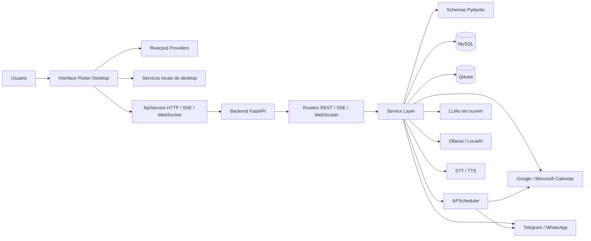
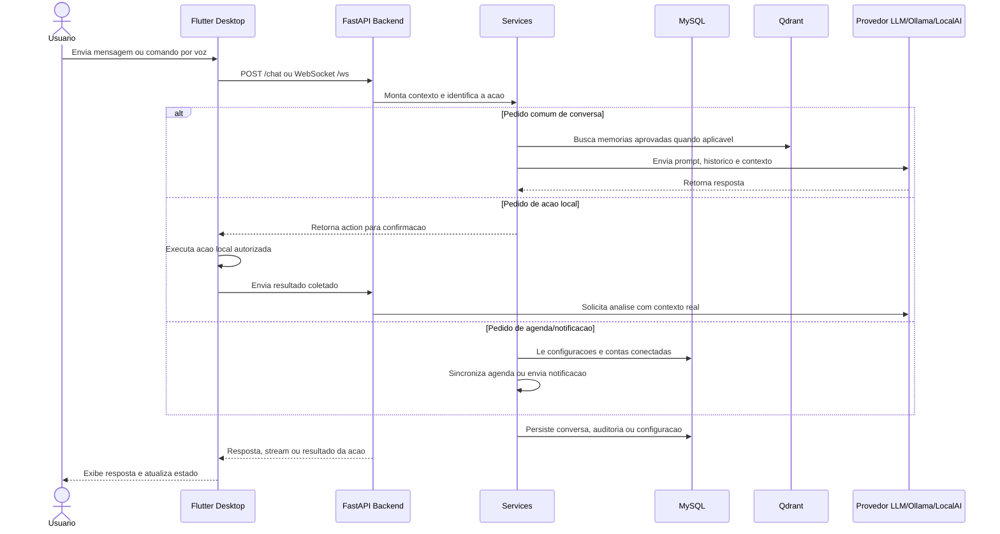
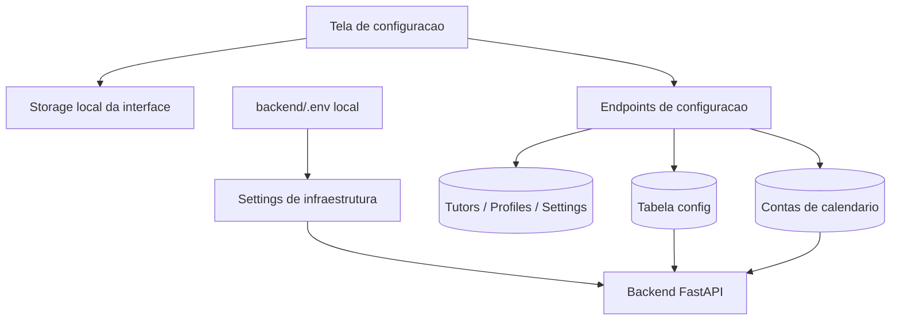

# Assistente Desktop 

Aplicacao de assistente pessoal desktop com backend FastAPI, interface Flutter,
memoria vetorial, automacoes locais, integracao com calendarios, voz,
notificacoes e multiplos provedores de LLM.

O projeto foi pensado para rodar localmente, com dados e credenciais sensiveis
fora do repositorio. O arquivo `backend/.env.example` documenta apenas as
variaveis de infraestrutura e provedores que continuam vindo do ambiente. As
configuracoes de notificacao e calendario sao persistidas no banco pela propria
aplicacao.

## Arquitetura

O projeto e dividido em duas aplicacoes principais: uma interface desktop em
Flutter e um backend local em FastAPI. O backend concentra regras de negocio,
persistencia, integracoes externas e comunicacao com provedores de LLM. A
interface fica responsavel pela experiencia desktop, estado visual, captura de
contexto local e comunicacao com a API.

```text
assistant_app/
|-- backend/                 FastAPI + Python
|   |-- app/
|   |   |-- core/            configuracao, banco e seguranca
|   |   |-- models/          schemas Pydantic e contratos de API
|   |   |-- routers/         endpoints REST, SSE e WebSocket
|   |   |-- services/        regras de negocio e integracoes externas
|   |   `-- utils/           scheduler e utilitarios
|   |-- tests/               testes unitarios do backend
|   |-- Dockerfile
|   `-- requirements.txt
|
|-- interface/               Flutter Desktop + Dart
|   |-- lib/
|   |   |-- models/          modelos de estado e DTOs
|   |   |-- providers/       estado global via Riverpod
|   |   |-- screens/         telas principais
|   |   |-- services/        clientes HTTP/WebSocket e servicos locais
|   |   |-- utils/           tema e helpers
|   |   `-- widgets/         componentes reutilizaveis
|   `-- test/                testes da interface
|
|-- ollama/                  imagem auxiliar para modelo local
|-- docker-compose.yml       MySQL, Qdrant, Ollama e backend
|-- setup.bat
`-- setup.sh
```

### Diagrama De Componentes



### Componentes

- **Interface desktop**: Flutter para Windows, macOS e Linux. Cuida de chat,
  configuracao inicial, captura de contexto local, atalhos, voz e preferencias.
- **Backend API**: FastAPI com REST, SSE e WebSocket para chat, historico,
  agenda, notificacoes, automacoes, memoria e acoes locais.
- **Banco relacional**: MySQL via SQLAlchemy async para conversas,
  configuracoes, perfis, atalhos, auditoria e automacoes aprovadas.
- **Memoria vetorial**: Qdrant para memorias revisadas e aprovadas.
- **LLMs**: provedores em nuvem configurados por `.env` e modelos locais via
  Ollama ou LocalAI.
- **Scheduler**: APScheduler para sincronizacao periodica de calendario e envio
  de lembretes.

## Diagrama De Fluxo Da Aplicacao

Fluxo principal de uma interacao de chat:



Fluxo de configuracao e persistencia:



## Padrao De Projeto

O projeto usa principalmente **arquitetura em camadas** com **Service Layer**.
O objetivo e manter transporte, regra de negocio, persistencia e UI separados.

### Backend

No backend, o padrao principal e:

- `routers`: camada de transporte. Recebe requests, valida entrada e devolve
  responses. Nao deve concentrar regra de negocio pesada.
- `services`: regras de negocio, integracoes externas e orquestracao.
- `models`: contratos Pydantic usados pela API e pela aplicacao.
- `core`: infraestrutura compartilhada, como configuracao, banco e seguranca.
- `utils`: processos auxiliares, como scheduler.

Na pratica, isso cria este fluxo:

```text
Request -> Router -> Service -> Database/Provider -> Service -> Response
```

Padroes usados no backend:

- **Service Layer**: `app/services` concentra integracoes com LLMs, calendario,
  notificacoes, voz, Qdrant e runtime config.
- **DTO / Schema Objects**: `app/models/schemas.py` define contratos de entrada
  e saida com Pydantic.
- **Dependency Injection simples**: FastAPI injeta sessoes de banco e
  autenticacao via `Depends`.
- **Repository leve via SQLAlchemy**: os modelos em `core/database.py` sao
  acessados pelos routers/services com sessoes async.
- **Configuration Object**: `core/config.py` centraliza settings vindos do
  ambiente.

### Interface

A interface segue separacao semelhante:

- `screens`: composicao de telas e fluxos principais.
- `widgets`: componentes visuais reutilizaveis.
- `services`: acesso ao backend, armazenamento local e integracoes do desktop.
- `providers`: estado global da aplicacao.
- `models`: configuracoes e estruturas de dados usadas pela UI.

Padroes usados na interface:

- **Provider/State Management**: Riverpod centraliza estado compartilhado.
- **Service Client**: `ApiService` encapsula HTTP, SSE e WebSocket.
- **Local Services**: servicos especificos isolam automacao local, workspace,
  scripts e contexto de janelas.
- **Component Composition**: telas sao compostas por widgets menores e
  reutilizaveis.

Esse desenho evita colocar regra de negocio nos endpoints ou nos widgets,
mantendo integracoes e fluxos testaveis em servicos dedicados.

## Configuracao Segura

Arquivos reais de ambiente e dados locais nao devem ser publicados:

- `backend/.env`
- `.env` e `.env.*`
- `backend/logs/`
- `backend/data/`
- `.venv/`
- `interface/build/`
- `interface/windows/flutter/ephemeral/`

Esses caminhos ja estao cobertos por `.gitignore` e `.dockerignore`.

Antes de publicar, crie o ambiente a partir do exemplo:

```bash
cd backend
cp .env.example .env
```

Preencha apenas o que for necessario para rodar localmente. Credenciais de
notificacao e OAuth de calendario devem ser configuradas pela tela da aplicacao,
pois sao salvas no banco.

### Proteção Do Primeiro Cadastro

O backend já bloqueia o cadastro depois que a primeira conta é criada. Para
exigir autorização administrativa também nessa primeira criação, configure no
serviço do backend:

```dotenv
REGISTRATION_INVITE_REQUIRED=true
REGISTRATION_ADMIN_EMAIL=admin@example.com
REGISTRATION_TOKEN_EXPIRE_MINUTES=30
REGISTRATION_TOKEN_REQUEST_COOLDOWN_SECONDS=60

SMTP_HOST=smtp.example.com
SMTP_PORT=587
SMTP_USERNAME=usuario-smtp
SMTP_PASSWORD=senha-smtp
SMTP_FROM=assistente@example.com
SMTP_STARTTLS=true
SMTP_USE_SSL=false
```

Na tela inicial, o usuário solicita o token. O backend envia o convite somente
ao e-mail administrativo configurado, mostra no app apenas o endereço mascarado
e aceita o token uma única vez. O banco armazena apenas o hash HMAC do token.

## Execucao Local

### Backend

```bash
cd backend
python -m venv .venv
.venv\Scripts\activate
pip install -r requirements.txt
python run.py
```

API local: `http://localhost:8000/docs`

### Interface

```bash
cd interface
flutter pub get
flutter run -d windows
```

Para macOS ou Linux, troque o device para `macos` ou `linux`.

### Docker

Na raiz do projeto:

```bash
docker-compose up -d
```

O compose sobe MySQL, Qdrant, Ollama e backend. A interface Flutter continua
sendo executada localmente.

### Ollama E LocalAI Na Railway

O backend trata Ollama e LocalAI como provedores separados:

| Provedor | Porta | Verificacao | Chat |
|----------|-------|-------------|------|
| Ollama | `11434` | `/api/tags` | `/api/chat` |
| LocalAI | `8080` | `/v1/models` e configuração instalada | `/v1/chat/completions` |

Crie estas variaveis **no servico do backend**:

```dotenv
OLLAMA_BASE_URL=http://${{ollama-7c414367-1ecc-440a-99b9-5125eb1185e9.RAILWAY_PRIVATE_DOMAIN}}:11434
OLLAMA_MODEL=llama3.2:3b

LOCALAI_BASE_URL=http://${{localai.RAILWAY_PRIVATE_DOMAIN}}:8080
LOCALAI_MODEL=minicpm5-1b-claude-opus-fable5-v2-thinking
LOCALAI_API_KEY=
```

O nome `localai` dentro da referencia deve ser igual ao nome do servico na
Railway. Tambem e aceito `LOCALAI_BASE_URL=localai.railway.internal`; o backend
inclui automaticamente `http://` e a porta `8080`. URLs do Ollama sem esquema
tambem sao normalizadas.

No **servico LocalAI**, configure:

```dotenv
LOCALAI_ADDRESS=:8080
LOCALAI_MODELS_PATH=/models
LOCALAI_BACKENDS_PATH=/models/.backends
LOCALAI_EXTERNAL_BACKENDS=llama-cpp
LOCALAI_CONTEXT_SIZE=2048
LOCALAI_THREADS=4
LOCALAI_AGENT_POOL_DEFAULT_MODEL=minicpm5-1b-claude-opus-fable5-v2-thinking
PRELOAD_MODELS=[{"id":"localai@minicpm5-1b-claude-opus-fable5-v2-thinking"}]
```

Anexe um Railway Volume ao servico LocalAI com mount path `/models`. Assim o
GGUF, o YAML e o backend CPU persistem em deploys. Sem esse volume, o preload
baixa novamente cerca de 1,1 GiB a cada novo container.

`LOCALAI_MODEL` deve ser o `id` instalado no LocalAI. O health check consulta
`/v1/models` e, para modelos ainda frios, também
`/api/models/config-json/{modelo}`. Quando a variavel
fica vazia, o backend escolhe o primeiro modelo retornado. A mensagem
`Agent pool started` confirma que o pool de agentes iniciou, mas o provedor so
fica disponivel no app depois que o modelo aparece no catalogo ou sua
configuracao instalada e confirmada.
Use `LOCALAI_API_KEY` no backend apenas se a autenticacao por API key estiver
habilitada no LocalAI.

Depois do redeploy, consulte `GET /health` no backend. O resultado esperado
inclui `localai` em `available_llms` e um status semelhante a:

```json
{
  "llm_status": {
    "localai": {
      "configured": true,
      "online": true,
      "available": true,
      "status": "online"
    }
  }
}
```

O endpoint detalhado aguarda a verificação dos provedores. Para o healthcheck
de liveness da Railway, use `GET /health/live`.

Os dominios `*.railway.internal` so podem ser acessados por outros servicos do
mesmo projeto e ambiente. Ollama e LocalAI nao precisam de dominio publico; a
interface conversa com o backend, e o backend acessa os provedores pela rede
privada.

Referencias: [Private Networking da Railway](https://docs.railway.com/private-networking)
e [API OpenAI-compatible do LocalAI](https://localai.io/basics/getting_started/index.html).

## Testes E Qualidade

Backend:

```bash
.\.venv\Scripts\python.exe -m pytest backend\tests
```

Interface:

```bash
cd interface
flutter analyze
flutter test
```

## Licenca

Este projeto e disponibilizado sob uma licenca de uso nao comercial. Uso,
copia, modificacao e distribuicao sao permitidos apenas para fins pessoais,
educacionais, de pesquisa ou internos sem finalidade comercial.

Uso comercial exige permissao previa por escrito. Consulte [LICENSE](LICENSE).

## Documentacao Complementar

- [backend/README.md](backend/README.md): endpoints, provedores locais,
  Railway, WebSocket e detalhes do servidor.
- [interface/README.md](interface/README.md): execucao, status dos provedores e
  estrutura da aplicacao Flutter.
