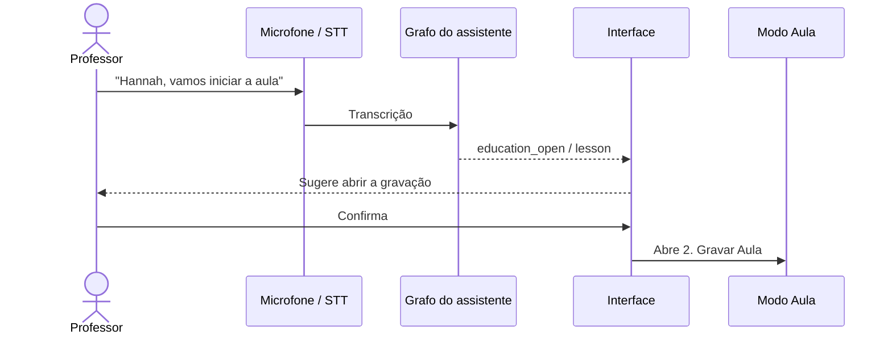

# Modo Educação

O Modo Aula reúne o fluxo acadêmico do professor em uma visão geral e cinco
abas operacionais:

- **Visão geral**: painel com semestres, turmas e quantidade de alunos, agenda
  semanal e atalhos para relatórios. Cada quadro abre a área operacional
  correspondente e pode ser atualizado sem fechar o Modo Aula.
- **Indicadores e IA**: cartões consolidam turmas ativas, alunos, encontros por
  semana e resumos recentes. Aulas registradas e próximos encontros aparecem
  logo abaixo, junto aos atalhos **Iniciar aula** e **Conversar**. O segundo
  retorna ao chat principal sem criar outra conversa ou copiar dados.

1. cadastro de disciplinas, turmas, horários e alunos;
2. gravação e transcrição de aulas;
3. pontuação extra identificada durante a fala;
4. histórico, correção de transcrição, resumo e PDF;
5. chamada por QR Code, presença, relatórios e agenda das turmas.

Antes da aula, **Configurações > Sistema > Microfone de entrada** permite
selecionar e ouvir um teste de cinco segundos do microfone real que será usado.
A captura é mono a 16 kHz, com ganho automático, supressão de ruído e
cancelamento de eco quando suportados pelo sistema. Headsets Bluetooth aparecem
como entrada `Hands-Free`/`Headset`; é necessário atualizar a lista depois de
conectá-los.

Na transcrição, o backend reduz repetições mecânicas do reconhecedor sem
reescrever o conteúdo da aula: remove frases exatas duplicadas, sequências de
três ou mais palavras iguais e sobreposição exata na fronteira dos blocos. O
texto continua editável no histórico para correções de conteúdo.

Os registros são separados por professor. Disciplinas e turmas pertencem a um
semestre no formato `AAAA.1` ou `AAAA.2`; encerrar o semestre remove essas
entidades dos fluxos atuais sem apagar o histórico.

O botão **Modo Aula** abre a visão geral quando já há turmas cadastradas.
Comandos estruturados para iniciar aula ou fazer chamada continuam abrindo
diretamente `2. Gravar Aula` ou `5. Presença`, respectivamente.

## Preparar uma apresentação

Em **Modo Aula > 1. Turmas**, clique em **Criar exemplo para apresentação**. A
operação autenticada cria, no semestre corrente:

- disciplina `DEMO-IA - Inteligência Artificial Aplicada`;
- turma `DEMO-AAAA.S - Turma de apresentação`;
- horário das 19h às 21h no dia da semana atual;
- três alunos fictícios com matrículas numéricas `2026001`, `2026002` e
  `2026003`.

A criação é idempotente: clicar novamente devolve a mesma disciplina e turma,
sem duplicar alunos. Exemplos antigos com matrículas `DEMO001` a `DEMO003` são
convertidos para as novas matrículas numéricas. Os nomes recebem o sufixo
`(Demo)` e podem ser removidos
pelas telas normais depois da apresentação.

O endpoint correspondente é:

```text
POST /education/demo/presentation
```

Ele sempre usa o professor da sessão autenticada; não recebe `tutor_id` do
cliente.

## Acionamento por voz

A transcrição do microfone segue para o mesmo grafo estruturado usado pelo
chat. Antes de consultar um LLM, o grafo reconhece intenções explícitas de
início de aula ou chamada e devolve uma ação `education_open`. Isso mantém o
comportamento disponível mesmo quando um provedor de IA está offline.

Exemplos com o nome configurado como `Hannah`:

```text
Hannah, vamos iniciar a aula.
Hannah, abra o modo educação.
Hannah, vou começar minha aula agora.
Hannah, faça a chamada dos alunos.
Hannah, abra a presença da turma.
```

Em **Configurações > Identidade**, a pronúncia pode ser cadastrada separadamente
do nome. Com nome visual `Hannah` e pronúncia `Raná`, tanto `Hannah, abra o modo
educação` quanto `Raná, abra o modo educação` ativam a mesma persona do usuário.
Sem nome personalizado, a palavra de ativação padrão é `Assistant`.

Pedidos de estudo, como `O que vimos na aula passada?`, continuam sendo
perguntas e não abrem a interface. Da mesma forma, `Faça uma chamada para o
João` não é interpretado como presença escolar.



A confirmação é obrigatória. O comando abre a aba adequada, mas não inicia a
gravação, não liga o microfone da aula e não gera QR Code sozinho. Para uma
chamada escolar, a interface abre diretamente `5. Presença`; a turma do dia
continua sujeita à seleção e confirmação normais. Quando há duas ou mais turmas
no dia, todas vêm selecionadas e compartilham uma única sessão e um único QR
Code; a seleção pode ser revisada antes da abertura.

Cada item em **Chamadas no período** oferece **Relatório exclusivo desta
chamada**. Ele separa os alunos por turma, informa matrícula e situação
presente/ausente, pode ser copiado em texto para o ambiente da faculdade e é o
único local para imprimir ou salvar a lista de presença em PDF. O arquivo recebe
somente o registro de chamada selecionado.

Para PDFs, **Gerar relatório** permite escolher independentemente:

- quadro semanal de aulas;
- turmas e alunos;
- disciplinas;
- relatório educacional geral, sem listas de presença.

A escolha abre a pré-visualização correspondente e cada documento possui nome
de arquivo próprio.

## Formato do resumo

O resumo da aula tem dois formatos, escolhidos no seletor **Formato do resumo**
que fica ao lado do botão que gera o resumo — tanto em `2. Gravar Aula` quanto
em `4. Histórico`:

- **Comum**: fio condutor da aula, principais tópicos, definições e fórmulas,
  tarefas e avisos, dúvidas levantadas. É o formato usado até aqui e cabe em
  uma tela.
- **Detalhado**: além do resumo geral, reconstrói o desenvolvimento na ordem em
  que a aula foi dada, os conceitos com a explicação que os acompanhou,
  demonstrações passo a passo, exemplos e exercícios resolvidos e os pontos de
  atenção destacados pelo professor. Serve para quem faltou ou vai estudar para
  a prova.

O detalhado escreve bem mais texto e leva mais tempo; em modelo local, ele
também reserva mais espaço de resposta e envia blocos menores de transcrição
por chamada. O formato usado fica gravado na aula: ao reabrir uma aula no
histórico, o seletor já vem marcado com o formato do resumo existente, e o
título do painel mostra se o que está na tela é `COMUM` ou `DETALHADO`.

No PDF exportado, o formato aparece na etiqueta do topo da primeira página
(`RESUMO DA AULA | DETALHADO`), na faixa que se repete nas páginas seguintes e
no título do documento. O arquivo do resumo detalhado ainda ganha o sufixo
`-detalhado`, então exportar os dois formatos da mesma aula não sobrescreve
nada.

Corrigir um trecho da transcrição continua invalidando o resumo, qualquer que
seja o formato — ele precisa ser gerado de novo.

## Segurança da chamada

Cada QR Code usa um token temporário aleatório e o banco armazena apenas seu
hash. A página pública mostra somente os dados necessários e aceita português,
espanhol e inglês. O aluno informa a matrícula; senhas e dados da sessão do
professor nunca são enviados para essa página.

Uma chamada criada por engano ou somente para teste pode ser removida pelo
ícone **Excluir chamada**, tanto no painel da chamada atual quanto na lista
**Chamadas no período**. A interface pede confirmação e exclui apenas a chamada,
suas presenças e a fotografia da lista daquele dia; turma, alunos e aula não são
apagados.

## Documentação relacionada

- [README principal](../README.md), com arquitetura e modelo de dados.
- [Backend](../backend/README.md), com execução, configuração e endpoints.
- [Interface](../interface/README.md), com requisitos e build Flutter.
- [Configuração de calendários](CONFIGURACAO_CALENDARIOS.md), para sincronizar
  aulas com Google Calendar ou Microsoft Outlook.
