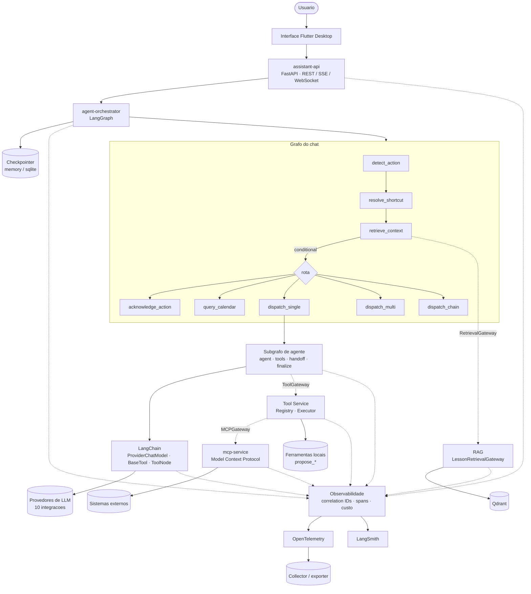
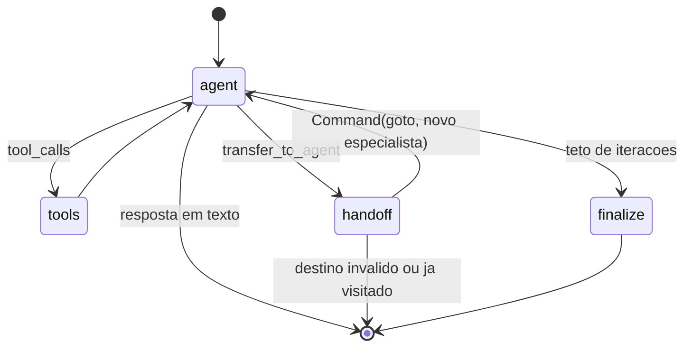
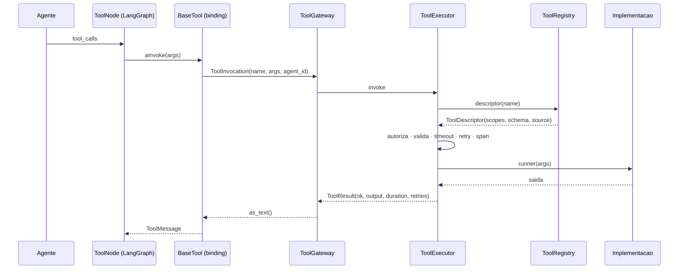

# Arquitetura agentiva: LangChain, LangGraph, MCP e Tool Calling

Este documento descreve como o backend do INTARQ organiza orquestracao,
componentes de IA, interoperabilidade e observabilidade — e, mais importante,
**por que cada tecnologia esta onde esta**.

A regra que organiza tudo:

| Camada | Responsabilidade | O que NAO faz |
|---|---|---|
| **LangChain** | Componentes e integracoes de IA: modelos, prompts, tools, retrievers, embeddings, parsers | Orquestracao, infraestrutura distribuida |
| **LangGraph** | Orquestracao stateful: nos, arestas, roteamento, ciclos, handoff, checkpoint | Protocolo MCP, execucao de ferramenta |
| **MCP** | Protocolo de interoperabilidade com capacidades externas | Decidir qual capacidade o agente usa |
| **Tool Service** | Catalogo, governanca e execucao das ferramentas | Falar protocolo externo diretamente |
| **Observabilidade** | Tracing, metricas, logs, custo e correlacao distribuida | Regra de negocio |
| **Application/API** | Exposicao das funcionalidades do produto | Conhecer implementacao concreta |

---

## 1. Visao geral



As setas **tracejadas** atravessam um contrato de `app.ports`: quem esta de um
lado nao conhece a implementacao do outro.

---

## 2. Estrutura de diretorios

```text
backend/
├── app/
│   ├── ports/                    contratos (Protocol) — sem SDK, sem I/O
│   │   ├── tools.py              ToolGateway, ToolDescriptor, ToolResult
│   │   ├── mcp.py                MCPGateway, MCPServerHealth
│   │   ├── retrieval.py          RetrievalGateway, RetrievedChunk
│   │   └── telemetry.py          TelemetrySink, SpanRecord, UsageRecord
│   │
│   ├── orchestration/            LangGraph
│   │   ├── agents.py             especialistas (dado puro, sem framework)
│   │   ├── state.py              ChatGraphState + ChatRuntimeContext
│   │   ├── routing.py            arestas condicionais
│   │   ├── checkpoint.py         persistencia e retomada
│   │   ├── agent_graph.py        subgrafo do agente (ToolNode + Command)
│   │   ├── graph.py              composicao e entrada publica
│   │   └── nodes/
│   │       ├── action_detection.py
│   │       ├── retrieval.py
│   │       ├── responses.py
│   │       └── dispatch.py
│   │
│   ├── toolkit/                  Tool Service (dominio)
│   │   ├── registry.py           catalogo, escopo, origem
│   │   ├── executor.py           validacao, timeout, retry, auditoria
│   │   └── catalog.py            registro de tools locais e MCP
│   │
│   ├── mcp/                      MCP (protocolo)
│   │   ├── config.py             parser de MCP_SERVERS
│   │   └── client.py             conexao, cache, retry, disjuntor
│   │
│   ├── adapters/                 implementacoes dos contratos
│   │   ├── container.py          composicao a partir da configuracao
│   │   ├── fakes.py              in-memory, para teste
│   │   ├── tools/                local · remote · langchain_binding
│   │   ├── mcp/                  local · remote
│   │   └── retrieval/            lesson_retriever
│   │
│   ├── core/observability/       transversal
│   │   ├── context.py            correlation IDs (contextvars + W3C)
│   │   ├── tracing.py            span() / span_sync()
│   │   ├── otel.py               adaptador OpenTelemetry (opcional)
│   │   ├── langsmith.py          ativacao opcional
│   │   ├── costs.py              tabela de preco e estimativa
│   │   ├── sinks.py              log · memoria · composto
│   │   └── middleware.py         correlacao HTTP e bootstrap
│   │
│   ├── services/                 dominio (RAG, educacao, agenda, providers…)
│   └── routers/                  REST · SSE · WebSocket
│
└── services/                     entrypoints de processo
    ├── common.py                 health, lifespan, graceful shutdown
    ├── mcp_service/main.py       porta MCP_SERVICE_PORT
    ├── tool_service/main.py      porta TOOL_SERVICE_PORT
    └── orchestrator/main.py      porta ORCHESTRATOR_PORT
```

---

## 3. LangGraph — orquestracao

### 3.1 Grafo do chat

Cada mensagem entra por `detect_action` e sai por uma de cinco rotas. A ordem
importa: **acao vem antes de resposta em texto**, porque "abre o VS Code" deve
virar acao para a interface executar, e nao um paragrafo explicando como abrir
o VS Code.

| No | O que faz | Falha |
|---|---|---|
| `detect_action` | Classifica em acao, consulta de agenda ou conversa | `RetryPolicy` |
| `resolve_shortcut` | Casa a mensagem com atalho cadastrado | Degrada para conversa |
| `retrieve_context` | Classifica a tarefa e busca aula quando for estudo | Degrada sem contexto |
| `acknowledge_action` | Confirma a acao ao usuario | — |
| `query_calendar` | Executa a consulta de agenda | Mensagem de erro controlada |
| `dispatch_single` | Entrega ao subgrafo de agente | Fallback entre provedores |
| `dispatch_multi` | Varios provedores em paralelo | Provedor que falha nao derruba |
| `dispatch_chain` | Provedores encadeados | Provedor que falha e pulado |

### 3.2 Subgrafo do agente

Antes era um `for hop in range(...)` com executor de ferramenta escrito a mao.
Agora sao nos e arestas:



O que se ganhou trocando o laco pelo grafo:

- **`ToolNode`** do LangGraph executa as chamadas — inclusive em paralelo — e
  monta `ToolMessage` no formato correto. Codigo nosso virou caminho testado do
  framework.
- **`Command(goto=...)`** transformou handoff em transicao observavel.
- **`RetryPolicy`** por no substitui a repeticao manual.
- **`context_schema`** carrega prompt, provedores e tetos **fora do estado**.

A governanca de ferramenta continua fora do grafo: o `ToolNode` recebe
`BaseTool` que apenas delegam ao Tool Gateway.

### 3.3 Estado x contexto

**Estado decide o fluxo; contexto permite a execucao acontecer.**

| `ChatGraphState` (persistido) | `ChatRuntimeContext` (por requisicao) |
|---|---|
| `message`, `history`, `mode` | `requested_llm`, `active_llms` |
| `system_prompt` (enriquecido pelos nos) | `tutor_id`, `user_id`, `timezone` |
| `action_kind`, `task_kind` | `conversation_id`, `execution_id` |
| `action`, `responses` | |
| `agent_id`, `tool_trace`, `handoffs`, `errors` | |

Provedor disponivel no momento da pausa nao e o mesmo no momento da retomada —
por isso ele nao entra em checkpoint. `tool_trace` e `handoffs` ficam no estado
porque a interface os exibe; **nenhuma aresta olha para eles**.

### 3.4 Checkpointing e retomada

```
thread_id     = "<tutor_id>:<session_id>"
execution_id  = identificador da passagem (idempotencia)
```

O dono dos dados entra **dentro do `thread_id`**, e nao em `checkpoint_ns`:
esse campo e reservado pelo LangGraph ao namespace de subgrafos, e usa-lo como
namespace de conta faz `aget_state` procurar um subgrafo inexistente.

`CHECKPOINT_BACKEND`:

- `memory` (padrao) — cobre a retomada dentro da mesma sessao sem dependencia
  extra.
- `sqlite` — sobrevive a restart; exige `langgraph-checkpoint-sqlite`.
- `none` — desliga; `resume_chat_graph` responde com erro explicito em vez de
  reprocessar uma conversa ja respondida.

---

## 4. LangChain — componentes

| Uso | Onde |
|---|---|
| `BaseChatModel` sobre o gateway de 10 provedores | `langchain_agent_service.ProviderChatModel` |
| `usage_metadata` padrao (tokens de entrada/saida/cache) | idem |
| `BaseTool` / `StructuredTool` para todo o catalogo | `assistant_tools`, `adapters/tools/langchain_binding` |
| `ToolNode`, `Command`, `RetryPolicy`, checkpointers | `orchestration/agent_graph.py` |
| Adaptador MCP (`langchain-mcp-adapters`) | `mcp/client.py` |

### O que deliberadamente NAO foi migrado

Migrar por migrar piora a arquitetura. Ficaram como estao, com motivo:

- **Cascata de embeddings.** Nenhuma integracao pronta tenta endpoint proprio →
  LocalAI → Ollama → modelo local em processo → OpenAI → hash offline. E o que
  faz o modo educacao funcionar sem chave e sem internet. Ela foi **vestida**
  com a interface `Embeddings`, nao substituida.
- **Gateway de provedores.** As 10 integracoes carregam credencial por usuario,
  normalizacao de erro e realimentacao de health. Trocar por `init_chat_model`
  perderia tudo isso. Foi **embrulhada** em `BaseChatModel`.
- **Parser de JSON do interpretador de agenda.** O scanner atual acha o primeiro
  objeto valido em meio a prosa, que e o modo de falha real observado. Um
  parser do framework nao resolveria melhor.
- **Deteccao de tarefa por regex.** Classificar com LLM custaria uma chamada
  extra so para decidir quem responde — o que anula a economia que a rota deve
  trazer.
- **`BaseRetriever` para as aulas.** A interface nao tem onde carregar o dono dos
  dados, e o contrato de RAG daqui exige `tenant_id` em toda busca. Tirar esse
  campo da assinatura para ganhar compatibilidade com cadeias que o projeto nao
  usa seria convidar um vazamento entre contas.
- **`Embeddings` e `BaseCallbackHandler` como adaptadores soltos.** Foram
  escritos durante a migracao e removidos: nenhum componente os consumia.
  Adaptador sem consumidor e exatamente a adocao artificial que esta arquitetura
  quer evitar — quando houver uma integracao oficial de provedor no processo, sao
  cem linhas para escrever com o caso de uso na mao.

---

## 5. Tool Calling — catalogo e governanca



**O agente nunca executa codigo de ferramenta.** Ele monta uma `ToolInvocation`
e entrega ao gateway.

### Escopo: negar por omissao

`ToolDescriptor.scopes` vazio significa **nenhum agente** — a ferramenta existe
no catalogo e pode ser chamada pelo grafo sem agente atribuido, mas nao entra na
lista que vai ao modelo. Assim uma ferramenta nova nao aparece para todos os
agentes so por ter sido registrada.

O escopo sai da declaracao dos especialistas (`orchestration/agents.py`), entao
liberar uma ferramenta para um agente novo e mexer em um lugar so.

### Falha vira resultado, nunca excecao

Uma ferramenta quebrada precisa virar texto que o modelo le e contorna. Excecao
subindo mataria a resposta inteira por causa de uma ferramenta.

### Retry so no que e transitorio

Argumento invalido ou ferramenta inexistente nao melhora tentando de novo.
Timeout e falha de transporte podem melhorar. Repetir o que nao e transitorio so
multiplica latencia.

---

## 6. MCP — protocolo, nao mecanismo

Antes, o agente importava `mcp_service` e concatenava as tools MCP a lista local.
MCP e Tool Calling eram a mesma abstracao.

Agora:

```
Agente → ToolGateway → ToolRegistry → [origem: local]  → funcao local
                                    → [origem: mcp]    → MCPGateway → mcp-service
```

Uma capacidade MCP vira **uma entrada do catalogo com `source="mcp"`**, cujo
executor delega ao `MCPGateway`. O agente dispara do mesmo jeito, a auditoria
registra de onde veio, e trocar o transporte MCP nao mexe em nenhum agente.

### Resiliencia

| Mecanismo | Motivo |
|---|---|
| Cache com TTL (`MCP_TOOLS_CACHE_TTL_SECONDS`) | Nao reconectar a cada mensagem |
| Retry com backoff e **teto** | Cobre oscilacao curta sem pendurar a requisicao |
| Disjuntor (`MCP_CIRCUIT_*`) | Nao pagar o timeout inteiro de um servidor ja sabidamente fora |
| Falha cacheada como lista vazia | O assistente responde sem aquelas capacidades |
| Catalogo preservado na falha | Oscilacao de rede nao muda o comportamento do agente |

### Contrato do mcp-service

```
GET  /health/live                 processo de pe
GET  /health/ready                consegue atender
GET  /mcp/servers                 estado por servidor (+ disjuntor)
GET  /mcp/tools?force=            capacidades anunciadas
POST /mcp/tools/{name}/invoke     execucao
POST /mcp/reset                   descarta cache e fecha o disjuntor
```

---

## 7. RAG

```
retrieve_context (no) → RetrievalGateway → LessonRetrievalGateway
                                         → qdrant_service → Qdrant
                                         → embedding_service (cascata)
```

- A busca so roda **no ramo de conversa** e **so quando a tarefa e estudo**.
  Pagar busca vetorial em toda mensagem encareceria o caminho mais comum.
- `tenant_id` e obrigatorio no contrato: a colecao e compartilhada e o
  isolamento e feito no filtro.
- Sem resultado, uma reindexacao de recuperacao roda **uma vez**, com intervalo
  minimo, para pergunta sem resposta nao virar reindexacao em loop.
- O contrato e proprio, e nao `BaseRetriever`: a interface do LangChain nao tem
  onde carregar o dono dos dados, e aqui isso e obrigatorio.

---

## 8. Observabilidade

### 8.1 Correlacao distribuida

```
request_id · trace_id · span_id · conversation_id · execution_id
agent_id   · tenant_id · user_id
```

Vivem em `ContextVar` — acompanham a corrotina sem virar parametro de funcao nem
entrar no estado do grafo. Ao cruzar processo, viajam em cabecalho:
`traceparent` (W3C), `X-Request-ID`, `X-Conversation-ID`, `X-Execution-ID`.

```
assistant-api → orchestrator → agente → no → tool-service → mcp-service → provedor
      └────────────────── mesmo trace_id ──────────────────┘
```

Cabecalho malformado nunca derruba a requisicao: gera-se um trace novo.

### 8.2 Dois planos, um trace

| Observabilidade de IA | Observabilidade da aplicacao |
|---|---|
| prompt, chamada de modelo, agente, grafo, tool, RAG | rota HTTP, banco, servico, latencia, erro |
| `UsageRecord` → custo | `SpanRecord` → OTel |
| LangSmith (opcional) | Collector OTLP |

Compartilham o mesmo `trace_id`, entao da para sair de um trace de rota lenta e
cair na chamada de modelo que a deixou lenta.

### 8.3 OpenTelemetry

```
Aplicacao → app.core.observability (abstracao) → OpenTelemetry → exporter
```

Nenhum modulo de dominio importa OTel. Sem o SDK instalado, `span()` continua
funcionando e emitindo para log e memoria — **a ausencia degrada, nao quebra**.
O endpoint vem de `OTEL_EXPORTER_ENDPOINT` / variaveis padrao do proprio SDK:
nao ha nome de fornecedor no codigo.

> Nao existe um `observability-service` proprio. Ele seria uma reimplementacao do
> OTel Collector — que ja resolve o problema e e substituivel por configuracao.
> O `docker-compose` traz o collector no profile `observability`.

### 8.4 Custos

`UsageRecord` guarda provider, model, tokens de entrada/saida/cache, duracao,
custo estimado, agente, tool e `execution_id`.

**`None` significa "o provedor nao informou", nunca zero.** Tratar ausencia como
zero produziria relatorio que parece barato e esta errado — por isso o custo sai
`None` quando nao ha dado, e `priced_calls` distingue o que foi precificado.

`GET /observability/costs?group_by=` agrega por `provider`, `model`, `agent_id`,
`tool_name`, `conversation_id`, `request_id` ou `execution_id`.

Precos por milhao de tokens vem de `LLM_PRICING` (aceita `provedor` e
`provedor:modelo`); a tabela interna e apenas ordem de grandeza.

### 8.5 Regra inviolavel

**Nenhum sink pode levantar excecao.** Falha ao observar nao pode derrubar o que
estava sendo observado. Ha teste para isso.

---

## 9. Servicos e fronteiras

Cada capacidade tem contrato, entrypoint, porta e health proprios. **O que roda
separado por padrao e decisao de configuracao, nao de codigo.**

| Servico | Porta (dev) | Padrao | Justificativa |
|---|---|---|---|
| `assistant-api` | `ASSISTANT_API_PORT` 8000 | sempre | exposicao do produto |
| `agent-orchestrator` | `ORCHESTRATOR_PORT` 8001 | in-process | credenciais por usuario vivem em `ContextVar`; extrair exigiria trafegar chave decifrada |
| `mcp-service` | `MCP_SERVICE_PORT` 8002 | in-process, extraivel | servidores `stdio` sobem **subprocesso** — isolamento de crash e restart independente sao ganho real |
| `tool-service` | `TOOL_SERVICE_PORT` 8003 | in-process, extraivel | as ferramentas so **montam proposta**, sem efeito colateral; o salto de rede seria latencia pura |
| collector OTLP | `OBSERVABILITY_PORT` 8004 | profile opcional | padrao aberto, substituivel |

Trocar o transporte:

```bash
MCP_TRANSPORT=remote   MCP_SERVICE_URL=http://mcp-service:8002
TOOL_TRANSPORT=remote  TOOL_SERVICE_URL=http://tool-service:8003
docker compose --profile services up
```

Nenhum agente ou no de grafo percebe a diferenca — e ha **testes de contrato**
que rodam a mesma assercao contra os dois transportes, para que as
implementacoes nao divirjam devagar.

### Health: `live` x `ready`

- `live` — o processo esta de pe; o orquestrador de container nao deve mata-lo.
- `ready` — o servico consegue atender; o cliente pode mandar trabalho.

Um `mcp-service` com todos os servidores fora do ar esta **vivo e nao pronto**.
Responder `200` nos dois casos faria o cliente insistir num servico que nao vai
atender.

---

## 10. Comunicacao entre servicos

HTTP/JSON. Nao ha mensageria: as interacoes sao sincronas e simples, e
introduzir fila para elas seria complexidade sem problema correspondente.

Clientes: `RemoteToolGateway`, `RemoteMCPGateway` — escondem transporte da camada
de dominio e propagam os cabecalhos de correlacao. Chamada `4xx` nao e repetida
(e decisao do servico, nao falha de rede); `5xx`, timeout e falha de transporte
sao repetidos com backoff e **teto**.

O streaming do chat continua em SSE/WebSocket direto da API — colocar um salto
extra no caminho do primeiro token pioraria justamente o que o usuario sente.

---

## 11. Inversao de dependencia

```
Agente  →  ToolGateway (Protocol)  →  LocalToolGateway | RemoteToolGateway | FakeToolGateway
Agente  →  MCPGateway  (Protocol)  →  LocalMCPGateway  | RemoteMCPGateway  | FakeMCPGateway
No RAG  →  RetrievalGateway        →  LessonRetrievalGateway | fake
Tudo    →  TelemetrySink           →  Logging | InMemory | OTel | Null
```

`app/adapters/container.py` e o unico modulo que conhece configuracao **e**
implementacoes ao mesmo tempo.

O teste e a prova: **nenhum teste de agente sobe servidor MCP ou tool-service**.
Se um deles passar a precisar de infraestrutura, a inversao foi perdida.

---

## 12. Testes

```bash
pytest                    # tudo
pytest -m unit            # unidade isolada
pytest -m integration     # componentes reais no mesmo processo
pytest -m contract        # local x remoto precisam concordar
```

| Arquivo | Cobre |
|---|---|
| `test_tool_registry.py` | catalogo, escopo, validacao, timeout, retry, span |
| `test_gateway_contracts.py` | equivalencia local ↔ remoto (tools e MCP), via ASGI real |
| `test_observability.py` | correlacao, `traceparent`, spans, custo, sink que falha |
| `test_graph_checkpoint.py` | estado gravado, retomada, isolamento por conta |
| `test_agent_service.py` | especialistas, escopo, handoff, fallback de provedor |
| `test_chat_graph_service.py` | rotas do grafo e precedencia de acao |
| `test_mcp_service.py` | parser, cache, retry, disjuntor, diagnostico |

---

## 13. Configuracao

Nada de URL, porta ou chave no codigo. Os valores em `Settings` sao **padroes de
desenvolvimento**.

> Para saber **qual variavel pertence a qual processo** - com bloco pronto por
> servico e a receita de separacao no Railway - veja
> [Configuracao por servico](configuracao-por-servico.md).

```bash
# Portas
ASSISTANT_API_PORT=8000  ORCHESTRATOR_PORT=8001
MCP_SERVICE_PORT=8002    TOOL_SERVICE_PORT=8003  OBSERVABILITY_PORT=8004

# Transporte
TOOL_TRANSPORT=local|remote     TOOL_SERVICE_URL=
MCP_TRANSPORT=local|remote      MCP_SERVICE_URL=

# Resiliencia
TOOL_TIMEOUT_SECONDS=20  TOOL_MAX_RETRIES=1  TOOL_RETRY_BACKOFF_SECONDS=0.5
MCP_TIMEOUT_SECONDS=30   MCP_MAX_RETRIES=2   MCP_RETRY_BACKOFF_SECONDS=0.5
MCP_CIRCUIT_FAILURE_THRESHOLD=3  MCP_CIRCUIT_RESET_SECONDS=60
MCP_TOOLS_CACHE_TTL_SECONDS=300

# Grafo
CHECKPOINT_BACKEND=memory|sqlite|none
CHECKPOINT_SQLITE_PATH=data/checkpoints.sqlite
GRAPH_NODE_MAX_RETRIES=2
AGENT_MAX_TOOL_ITERATIONS=3  AGENT_MAX_HANDOFFS=2

# Observabilidade
OTEL_ENABLED=false  OTEL_SERVICE_NAME=assistant-api  OTEL_EXPORTER_ENDPOINT=
TELEMETRY_MEMORY_EVENTS=2000
LANGSMITH_ENABLED=false  LANGSMITH_API_KEY=  LANGSMITH_PROJECT=assistant-app
LLM_PRICING=
```

---

## 14. Deploy em PaaS (Railway, Render, Fly)

O backend continua sendo **um processo so** no deploy padrao: `mcp-service` e
`tool-service` rodam in-process, entao subir na Railway nao mudou de forma. O que
a migracao acrescentou e a lista de cuidados abaixo.

### Porta

A plataforma injeta `PORT` e roteia o trafego para ela. Por isso `PORT` tem
**precedencia** sobre `ASSISTANT_API_PORT` na configuracao.

> Nao copie `ASSISTANT_API_PORT=8000` do `.env.example` para as variaveis do
> deploy. Ele fixaria a porta local num ambiente onde ela nao vale, e o
> healthcheck falharia sem mensagem util.

### Memoria do checkpointer

O `InMemorySaver` do LangGraph **nunca descarta nada** — a propria documentacao
dele diz que serve para depuracao e teste. Num processo de vida longa isso e um
vazamento: cada mensagem deixa checkpoints com uma copia do estado.

Medido neste projeto: **~7 KB por conversa de uma mensagem**, sem liberacao.

Por isso o padrao e `BoundedMemorySaver`, com fila de uso e teto:

| `CHECKPOINT_MAX_THREADS` | Memoria retida (estavel) |
|---|---|
| 200 (padrao) | ~1,4 MB |
| 500 | ~3,5 MB |
| sem teto (`InMemorySaver` cru) | cresce sem limite |

Ler ou gravar renova a posicao da conversa na fila, entao uma conversa ativa nao
e descartada por ser a mais antiga a ter escrito. Em container pequeno, baixe o
teto; em instancia grande, suba.

Para persistir entre deploys, `CHECKPOINT_BACKEND=sqlite` exige
`langgraph-checkpoint-sqlite` instalado **e** um volume montado em
`CHECKPOINT_SQLITE_PATH` — sem volume, o arquivo morre no proximo deploy e o
efeito e o mesmo de `memory`.

### Observabilidade

`OTEL_ENABLED=false` e o padrao e deve continuar assim **sem um collector
alcancavel**. Ligado sem collector, o SDK registra falha de envio a cada lote e
polui o log. Na Railway, aponte `OTEL_EXPORTER_ENDPOINT` para o dominio privado
do collector (`http://collector.railway.internal:4318`).

`TELEMETRY_MEMORY_EVENTS=2000` ja e uma janela limitada; nao cresce.

### Transporte remoto

Se um dia extrair `mcp-service` ou `tool-service` como servicos separados na
Railway, os defaults de URL (`127.0.0.1:porta`) nao servem — use o dominio
privado:

```bash
MCP_TRANSPORT=remote
MCP_SERVICE_URL=http://mcp-service.railway.internal:8002
TOOL_TRANSPORT=remote
TOOL_SERVICE_URL=http://tool-service.railway.internal:8003
```

Os dominios `*.railway.internal` so respondem entre servicos do mesmo projeto, e
o healthcheck de liveness continua sendo `GET /health/live`.

### Peso adicionado

As dependencias novas (OpenTelemetry, `langgraph-prebuilt`,
`langgraph-checkpoint`, `langsmith`) somam **~2,5 MB** e resolvem com
`--only-binary=:all:`, que e o modo usado no `Dockerfile` — o build nao muda.

### Confira tambem

`RELOAD` continua com padrao `true` em `Settings` (comportamento anterior a esta
migracao). Em producao, `RELOAD=false`: o reloader do uvicorn sobe um processo
extra e um watcher de arquivos que nao servem para nada num container.

---

## 15. Tratamento de falhas

| Falha | Comportamento |
|---|---|
| Servidor MCP fora do ar | Assistente responde sem aquelas capacidades; disjuntor evita repetir o custo |
| tool-service inalcancavel | Agente responde sem ferramenta |
| Ferramenta estoura o timeout | `ToolResult(ok=False)` — o modelo le e contorna |
| Provedor sem saldo | Fallback para o proximo **quando o usuario nao escolheu um** |
| Provedor escolhido na interface falha | Falha visivel, sem troca silenciosa |
| Qdrant fora do ar | Resposta do conhecimento geral |
| Banco fora do ar na busca de atalho | Conversa segue para o modelo |
| Collector OTLP ausente | Telemetria fica em log e memoria |
| Sink de telemetria quebrado | Operacao observada conclui normalmente |
| Grafo lanca excecao | Resposta controlada, com `errors` preenchido |

O principio comum: **degradar a funcionalidade que depende do recurso ausente,
nunca a conversa inteira.**
