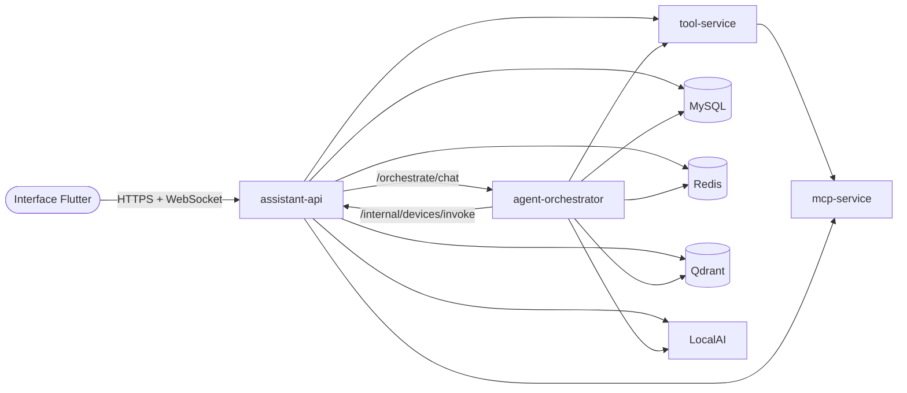

# Deploy na Railway

Guia operacional para subir o backend completo na Railway: quais serviços criar,
em que ordem, com que configuração e quais variáveis. Para o *porquê* de cada
variável, veja [Configuração por serviço](configuracao-por-servico.md); para as
fronteiras entre processos, [Arquitetura agentiva](agentes.md).

> Os nomes de serviço abaixo (`assistant-api`, `agent-orchestrator`,
> `tool-service`, `mcp-service`, `mysql`, `Redis`, `qdrant`, `localai`) são
> sugestões. Nas referências `${{servico.VARIAVEL}}`, use **exatamente** o nome
> que o serviço tem no seu projeto — inclusive nomes gerados pela Railway, como
> `serene-creation`. Referência para serviço inexistente vira texto vazio, sem
> erro.

---

## Topologia



| Serviço | Origem | Domínio público | Volume | Função |
|---|---|:---:|---|---|
| `assistant-api` | `backend/Dockerfile` | **sim** | `/app/data` | autenticação, rotas, WebSocket, modo educação, voz |
| `agent-orchestrator` | `backend/Dockerfile` | não | `/app/data` (opcional) | grafo do chat |
| `tool-service` | `backend/Dockerfile.tool-service` | não | — | catálogo e governança das ferramentas |
| `mcp-service` | `backend/Dockerfile.mcp-service` | não | — | servidores MCP |
| `mysql` | template Railway ou imagem `mysql` | não | `/var/lib/mysql` | banco relacional |
| `Redis` | template Railway | não | do template | rate limiting e cache de status dos provedores |
| `qdrant` | imagem `qdrant/qdrant:v1.12.6` | não | `/qdrant/storage` | índice vetorial das aulas e memórias |
| `localai` | imagem LocalAI | não | `/models` | LLM local (opcional) |

Só a `assistant-api` recebe tráfego de fora. Todo o resto conversa pela rede
privada (`*.railway.internal`), que só existe entre serviços do mesmo projeto e
ambiente.

---

## Ordem de criação

Crie de dentro para fora e confira cada serviço antes do próximo — quando algo
falhar, o culpado é o último que você mexeu.

1. `mysql`, `Redis`, `qdrant` (e `localai`, se usar), com **App Sleeping
   desligado**: serviço dormindo só acorda no primeiro acesso, e o boot da API
   e do orquestrador pode pegá-lo ainda parado
2. `mcp-service`
3. `tool-service`
4. `agent-orchestrator`
5. `assistant-api`

---

## Segredos

Gere uma vez e guarde num cofre:

```bash
python -c "import secrets; print(secrets.token_hex(32))"      # SECRET_KEY
python -c "import secrets; print(secrets.token_hex(32))"      # JWT_SECRET
python -c "import secrets; print(secrets.token_hex(32))"      # CREDENTIAL_ENCRYPTION_KEY
python -c "import secrets; print(secrets.token_urlsafe(48))"  # INTERNAL_SERVICE_TOKEN
```

| Segredo | Onde | Regra |
|---|---|---|
| `SECRET_KEY`, `JWT_SECRET` | `assistant-api`, `agent-orchestrator` | iguais nos dois |
| `CREDENTIAL_ENCRYPTION_KEY` | `assistant-api`, `agent-orchestrator` | iguais nos dois; **nunca rotacione** — as chaves salvas no banco deixam de abrir |
| `INTERNAL_SERVICE_TOKEN` | `assistant-api`, `agent-orchestrator` | iguais nos dois; vazio fecha as rotas internas |

> **Instalação que já rodou sem `CREDENTIAL_ENCRYPTION_KEY`** cifrou as
> credenciais com o `JWT_SECRET`. Para não perder nada, use o valor atual do
> `JWT_SECRET` também como `CREDENTIAL_ENCRYPTION_KEY`.

Uma alternativa a repetir valores é a Railway **Shared Variables** do ambiente,
referenciada como `${{shared.JWT_SECRET}}`.

---

## Infraestrutura

### MySQL e Redis

O Redis vem do template da Railway e publica `REDIS_URL`.

O MySQL pode ter sido criado de dois jeitos, e **os nomes das variáveis mudam**
entre eles. Abra a aba *Variables* do serviço e veja qual conjunto existe:

| Criado a partir de | Ícone no canvas | Variáveis publicadas | `DATABASE_URL` |
|---|---|---|---|
| Template MySQL da Railway | logo do MySQL | `MYSQLUSER`, `MYSQLPASSWORD`, `MYSQLDATABASE` | `mysql+aiomysql://${{MySQL.MYSQLUSER}}:${{MySQL.MYSQLPASSWORD}}@${{MySQL.RAILWAY_PRIVATE_DOMAIN}}:3306/${{MySQL.MYSQLDATABASE}}` |
| Imagem Docker `mysql` | cubo | `MYSQL_USER`, `MYSQL_PASSWORD`, `MYSQL_DATABASE` (as que você definiu) | `mysql+aiomysql://${{mysql.MYSQL_USER}}:${{mysql.MYSQL_PASSWORD}}@${{mysql.RAILWAY_PRIVATE_DOMAIN}}:3306/${{mysql.MYSQL_DATABASE}}` |

Referência a variável que não existe resolve **vazia**, e a URL vira
`mysql+aiomysql://:@host:3306/`. O backend detecta isso no boot e registra
`DATABASE_URL incompleta: usuario vazio, nome do banco vazio`; sem esse aviso, o
driver só diria `Access denied for user 'app'`, o usuário do container. Confira
o valor resolvido passando o mouse sobre a variável no painel.

A `MYSQL_URL` do template começa com `mysql://` (driver síncrono). Se usá-la, o
backend troca para `mysql+aiomysql://` sozinho e avisa no log, mas prefira montar
a URL como na tabela.

Os blocos abaixo usam a imagem Docker (`mysql`, com `MYSQL_USER`). Com o
template, troque pela linha da tabela.

### qdrant

- **Imagem:** `qdrant/qdrant:v1.12.6`
- **Volume:** `/qdrant/storage`

```dotenv
# Opcional. Se definir, repita o valor em QDRANT_API_KEY da API e do orquestrador.
QDRANT__SERVICE__API_KEY=
# Só em ambiente Railway antigo, com rede privada apenas IPv6:
# QDRANT__SERVICE__HOST=::
```

### localai

Configuração completa na seção *Ollama E LocalAI Na Railway* do `README.md` da raiz. Resumo:
volume em `/models`, `LOCALAI_ADDRESS=:8080` e o modelo em `PRELOAD_MODELS`.
`LOCALAI_MODEL` na API e no orquestrador precisa ser o `id` instalado no LocalAI.

---

## `mcp-service`

| Configuração | Valor |
|---|---|
| Root directory | `backend` |
| Dockerfile | variável `RAILWAY_DOCKERFILE_PATH` abaixo |
| Start command | vazio (o `CMD` da imagem) |
| Healthcheck | `/health/live` |
| Domínio público | nenhum |

```dotenv
RAILWAY_DOCKERFILE_PATH="Dockerfile.mcp-service"
HOST="0.0.0.0"
PORT="8002"
RELOAD="false"
LOG_LEVEL="info"

# JSON; vazio é válido (serviço sobe sem servidores).
# stdio com npx exige imagem construída com WITH_NODE=true.
MCP_SERVERS=""
MCP_TIMEOUT_SECONDS="30"
MCP_MAX_RETRIES="2"
MCP_RETRY_BACKOFF_SECONDS="0.5"
MCP_CIRCUIT_FAILURE_THRESHOLD="3"
MCP_CIRCUIT_RESET_SECONDS="60"
MCP_TOOLS_CACHE_TTL_SECONDS="300"

OTEL_ENABLED="false"
```

**Watch paths**

```
backend/shared/**
backend/services/common.py
backend/services/mcp_service/**
backend/requirements-mcp-service.txt
backend/Dockerfile.mcp-service
```

**Confira no log:** `services.mcp_service.main:app escutando em 0.0.0.0:8002`.

---

## `tool-service`

| Configuração | Valor |
|---|---|
| Root directory | `backend` |
| Dockerfile | variável `RAILWAY_DOCKERFILE_PATH` abaixo |
| Start command | vazio |
| Healthcheck | `/health/live` (nunca `/health/ready`) |
| Domínio público | nenhum |

```dotenv
RAILWAY_DOCKERFILE_PATH="Dockerfile.tool-service"
HOST="0.0.0.0"
PORT="8003"
RELOAD="false"
LOG_LEVEL="info"

TOOL_TIMEOUT_SECONDS="20"
TOOL_MAX_RETRIES="1"
TOOL_RETRY_BACKOFF_SECONDS="0.5"

MCP_TRANSPORT="remote"
MCP_SERVICE_URL="http://${{mcp-service.RAILWAY_PRIVATE_DOMAIN}}:8002"
MCP_TIMEOUT_SECONDS="30"
MCP_MAX_RETRIES="2"
MCP_RETRY_BACKOFF_SECONDS="0.5"

OTEL_ENABLED="false"
```

Não coloque aqui `DATABASE_URL`, `JWT_SECRET`, `CREDENTIAL_ENCRYPTION_KEY` nem
chaves de provedor: o serviço não carrega banco nem cifra.

**Watch paths**

```
backend/shared/**
backend/services/common.py
backend/services/tool_service/**
backend/app/**
backend/requirements-tool-service.txt
backend/Dockerfile.tool-service
```

**Confira no log:** `tool-service pronto: N ferramentas`.

---

## `agent-orchestrator`

| Configuração | Valor |
|---|---|
| Root directory | `backend` |
| Dockerfile | `Dockerfile` (imagem cheia) |
| Start command | **`python -m services.orchestrator.main`** — obrigatório |
| Healthcheck | `/health/live` |
| Domínio público | nenhum |
| Volume | `/app/data` (opcional; evita baixar o modelo de embeddings a cada deploy) |

```dotenv
HOST="0.0.0.0"
PORT="8001"
RELOAD="false"
LOG_LEVEL="info"

# --- entre serviços ------------------------------------------------------------
INTERNAL_SERVICE_TOKEN="<mesmo da assistant-api>"
ASSISTANT_API_URL="http://${{assistant-api.RAILWAY_PRIVATE_DOMAIN}}:8000"

# --- segredos: iguais aos da assistant-api ------------------------------------
SECRET_KEY="<mesmo da assistant-api>"
JWT_SECRET="<mesmo da assistant-api>"
CREDENTIAL_ENCRYPTION_KEY="<mesmo da assistant-api>"

# --- dados ----------------------------------------------------------------------
DATABASE_URL="mysql+aiomysql://${{mysql.MYSQL_USER}}:${{mysql.MYSQL_PASSWORD}}@${{mysql.RAILWAY_PRIVATE_DOMAIN}}:3306/${{mysql.MYSQL_DATABASE}}"
REDIS_URL="${{Redis.REDIS_URL}}"
QDRANT_URL="http://${{qdrant.RAILWAY_PRIVATE_DOMAIN}}:6333"
QDRANT_API_KEY=""
QDRANT_COLLECTION_PREFIX="assistant"
QDRANT_VECTOR_SIZE="384"

# --- embeddings e provedores locais: iguais aos da assistant-api ---------------
EMBEDDING_PROVIDER="local"
EMBEDDING_MODEL=""
EMBEDDING_LOCAL_MODEL="sentence-transformers/paraphrase-multilingual-MiniLM-L12-v2"
EMBEDDING_CACHE_DIR="/app/data/hf-cache"
RAILWAY_RUN_UID="0"
OLLAMA_BASE_URL=""
LOCALAI_BASE_URL="http://${{localai.RAILWAY_PRIVATE_DOMAIN}}:8080"
LOCALAI_MODEL="<id do modelo instalado no LocalAI>"
LOCALAI_API_KEY=""
LOCAL_LLM_CONTEXT_TOKENS="8192"

# --- ferramentas e MCP ---------------------------------------------------------
TOOL_TRANSPORT="remote"
TOOL_SERVICE_URL="http://${{tool-service.RAILWAY_PRIVATE_DOMAIN}}:8003"
MCP_TRANSPORT="remote"
MCP_SERVICE_URL="http://${{mcp-service.RAILWAY_PRIVATE_DOMAIN}}:8002"
TOOL_TIMEOUT_SECONDS="20"
TOOL_MAX_RETRIES="1"
MCP_TIMEOUT_SECONDS="30"
MCP_MAX_RETRIES="2"
MCP_RETRY_BACKOFF_SECONDS="0.5"

# --- grafo ---------------------------------------------------------------------
AGENT_MAX_TOOL_ITERATIONS="3"
AGENT_MAX_HANDOFFS="2"
CHECKPOINT_BACKEND="memory"
CHECKPOINT_MAX_THREADS="200"
GRAPH_NODE_MAX_RETRIES="2"

# --- observabilidade -----------------------------------------------------------
OTEL_ENABLED="false"
LANGSMITH_ENABLED="false"
LANGSMITH_API_KEY=""
LANGSMITH_PROJECT="assistant-app"
```

Sem volume, apague `EMBEDDING_CACHE_DIR` e `RAILWAY_RUN_UID`.

**Watch paths**

```
backend/app/**
backend/shared/**
backend/services/common.py
backend/services/orchestrator/**
backend/requirements.txt
backend/Dockerfile
```

**Confira:** `GET /health/ready` (pela rede interna) responde `ok: true` e
`internal_token_configured: true`.

---

## `assistant-api`

| Configuração | Valor |
|---|---|
| Root directory | `backend` |
| Dockerfile | `Dockerfile` |
| Start command | vazio (`python run.py`) |
| Healthcheck | `/health/live` |
| Domínio público | **sim**, apontando para a porta `8000` |
| Volume | `/app/data` |

```dotenv
# --- processo ------------------------------------------------------------------
HOST="0.0.0.0"
# Fixa a porta: o orquestrador chama a API por <dominio-privado>:8000, e o
# domínio público deve apontar para ela.
PORT="8000"
RELOAD="false"
LOG_LEVEL="info"
FORWARDED_ALLOW_IPS="*"
CORS_ORIGINS="https://${{RAILWAY_PUBLIC_DOMAIN}}"

# --- segredos ------------------------------------------------------------------
SECRET_KEY="<gerado>"
JWT_SECRET="<gerado>"
JWT_ALGORITHM="HS256"
JWT_EXPIRE_MINUTES="1440"
CREDENTIAL_ENCRYPTION_KEY="<gerado; nunca rotacione>"
INTERNAL_SERVICE_TOKEN="<gerado>"

# --- dados ----------------------------------------------------------------------
DATABASE_URL="mysql+aiomysql://${{mysql.MYSQL_USER}}:${{mysql.MYSQL_PASSWORD}}@${{mysql.RAILWAY_PRIVATE_DOMAIN}}:3306/${{mysql.MYSQL_DATABASE}}"
# Só no primeiro deploy, se quiser dados de demonstração (roda uma única vez).
DATABASE_SEED=""
REDIS_URL="${{Redis.REDIS_URL}}"
QDRANT_URL="http://${{qdrant.RAILWAY_PRIVATE_DOMAIN}}:6333"
QDRANT_API_KEY=""
QDRANT_COLLECTION_PREFIX="assistant"
QDRANT_VECTOR_SIZE="384"

# --- provedores locais ---------------------------------------------------------
OLLAMA_BASE_URL=""
LOCALAI_BASE_URL="http://${{localai.RAILWAY_PRIVATE_DOMAIN}}:8080"
LOCALAI_MODEL="<id do modelo instalado no LocalAI>"
LOCALAI_API_KEY=""
LOCAL_LLM_CONTEXT_TOKENS="8192"

# --- embeddings ----------------------------------------------------------------
EMBEDDING_PROVIDER="local"
EMBEDDING_MODEL=""
EMBEDDING_LOCAL_MODEL="sentence-transformers/paraphrase-multilingual-MiniLM-L12-v2"
EMBEDDING_CACHE_DIR="/app/data/hf-cache"
RAILWAY_RUN_UID="0"

# --- voz (sem GPU na Railway) --------------------------------------------------
WHISPER_MODEL="base"
WHISPER_DEVICE="cpu"
WHISPER_COMPUTE_TYPE="int8"
STT_PROVIDER="local"
TTS_PROVIDER="auto"

# --- modo educação -------------------------------------------------------------
EDUCATION_SEGMENT_SECONDS="60"
EDUCATION_SUMMARY_MAX_CHARS="24000"
EDUCATION_MIN_SEGMENT_CHARS="12"
EDUCATION_SUMMARY_PROVIDER_TIMEOUT_SECONDS="180"
EDUCATION_SUMMARY_MAX_PROVIDERS="3"
EDUCATION_SUMMARY_ALLOW_PAID_FALLBACK="true"
OCR_ENABLED="true"
OCR_MAX_PAGES="20"

# --- cadastro e e-mail ---------------------------------------------------------
REGISTRATION_INVITE_REQUIRED="true"
REGISTRATION_ADMIN_EMAIL="<email do primeiro admin>"
REGISTRATION_TOKEN_EXPIRE_MINUTES="30"
REGISTRATION_TOKEN_REQUEST_COOLDOWN_SECONDS="60"
PASSWORD_RESET_TOKEN_EXPIRE_MINUTES="30"
PASSWORD_RESET_REQUEST_COOLDOWN_SECONDS="60"
SMTP_FROM="<remetente verificado na Brevo>"
BREVO_API_KEY="<chave da Brevo>"

# --- serviços extraídos --------------------------------------------------------
ORCHESTRATOR_TRANSPORT="remote"
ORCHESTRATOR_URL="http://${{agent-orchestrator.RAILWAY_PRIVATE_DOMAIN}}:8001"
ORCHESTRATOR_TIMEOUT_SECONDS="300"
ORCHESTRATOR_MAX_RETRIES="1"
TOOL_TRANSPORT="remote"
TOOL_SERVICE_URL="http://${{tool-service.RAILWAY_PRIVATE_DOMAIN}}:8003"
MCP_TRANSPORT="remote"
MCP_SERVICE_URL="http://${{mcp-service.RAILWAY_PRIVATE_DOMAIN}}:8002"
TOOL_TIMEOUT_SECONDS="20"
TOOL_MAX_RETRIES="1"
MCP_TIMEOUT_SECONDS="30"
MCP_MAX_RETRIES="2"
MCP_RETRY_BACKOFF_SECONDS="0.5"
CHECKPOINT_BACKEND="memory"
CHECKPOINT_MAX_THREADS="200"

# --- opcionais -----------------------------------------------------------------
# Chaves globais: só migração da primeira conta admin; cada usuário usa as suas.
# CLAUDE_API_KEY=""   OPENAI_API_KEY=""   GEMINI_API_KEY=""   GROQ_API_KEY=""
# Calendários (callbacks: https://<dominio>/calendar/{google|microsoft}/oauth-callback)
# GOOGLE_OAUTH_CLIENT_ID=""   GOOGLE_OAUTH_CLIENT_SECRET=""
# MICROSOFT_OAUTH_CLIENT_ID=""   MICROSOFT_OAUTH_CLIENT_SECRET=""   MICROSOFT_OAUTH_TENANT_ID="common"
# Notificações
# TELEGRAM_BOT_TOKEN=""   TELEGRAM_CHAT_ID=""
```

**Watch paths**

```
backend/app/**
backend/shared/**
backend/services/common.py
backend/requirements.txt
backend/Dockerfile
backend/static/**
```

**Confira no log de boot:**

```
Orquestrador remoto em http://...:8001
Tool service remoto em http://...:8003
MCP remoto em http://...:8002
```

---

## Interface

A interface não lê variável de ambiente. O endereço vem de
`interface/assets/config/app_defaults.json` (ou de um `intarq_config.json` ao
lado do executável):

```json
{ "backendUrl": "https://<dominio-publico-da-assistant-api>", "environment": "production" }
```

---

## Voltar a um processo só

Na `assistant-api`, troque para `local` e remova as URLs:

```dotenv
ORCHESTRATOR_TRANSPORT="local"
TOOL_TRANSPORT="local"
MCP_TRANSPORT="local"
```

Sem redeploy dos outros serviços e sem mudar código; eles podem ficar ociosos
ou ser apagados.

---

## Problemas comuns

| Sintoma | Causa provável |
|---|---|
| Todo chat responde "Não consegui processar sua mensagem agora" | `INTERNAL_SERVICE_TOKEN` vazio ou diferente entre API e orquestrador — a causa exata está no log da API |
| Provedores de nuvem somem só no chat | `CREDENTIAL_ENCRYPTION_KEY` do orquestrador diferente da API |
| Agente não usa capacidades da máquina do usuário | `ASSISTANT_API_URL` errado no orquestrador, ou mais de uma réplica da API |
| Timeout nas URLs `.railway.internal` | porta errada na URL (compare com `escutando em` no log) ou ambiente só IPv6 — use `HOST="::"` |
| Healthcheck reprova sem mensagem | `PORT` copiado do `.env.example` local, ou healthcheck em `/health/ready` no tool-service |
| OAuth de calendário recusa o redirect | falta `FORWARDED_ALLOW_IPS="*"` na API |
| `Access denied for user 'app'@... (using password: NO)` | referências do `DATABASE_URL` apontam para variáveis que o MySQL não publica (`MYSQLUSER` numa imagem que publica `MYSQL_USER`); o log de boot mostra `DATABASE_URL incompleta` |
| Serviços dormindo demoram ou falham no primeiro acesso | App Sleeping ligado em banco ou serviço interno — desligue em *Settings → Serverless* |
| Modelo de embeddings baixado a cada deploy | sem volume em `/app/data` ou sem `RAILWAY_RUN_UID="0"` |
| Streaming (`/chat/stream`) funciona e o chat completo não | streaming fica na API; o chat completo passa pelo orquestrador — verifique o orquestrador |

## Limitações do arranjo

- **Uma réplica da `assistant-api`.** O WebSocket de cada sessão vive numa
  réplica; a volta das capacidades da máquina pode cair em outra.
- **Checkpoint em memória no orquestrador.** Com mais de uma réplica dele, a
  retomada de execução só funciona na réplica que gravou.
